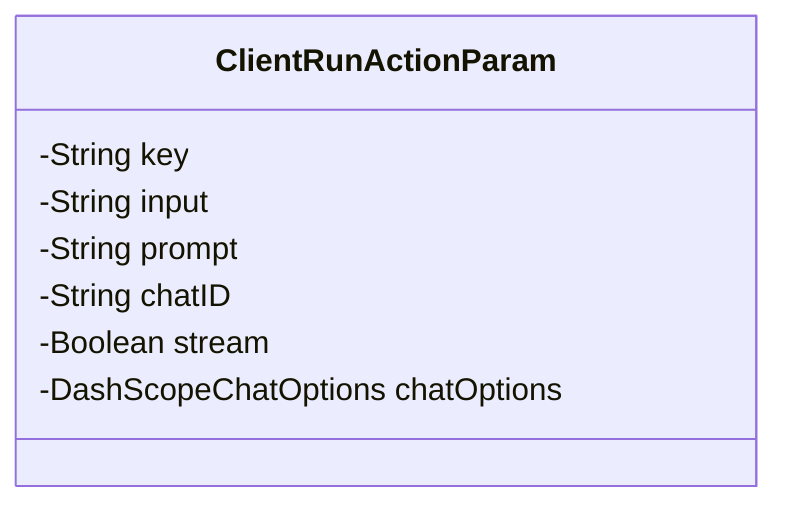
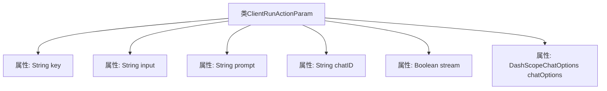

# 基础信息

|      |      |
|------|------|
| 名称 | ClientRunActionParam |
| 编码语言 | .java |
| 代码路径 | spring-ai-alibaba/spring-ai-alibaba-studio/src/main/java/com/alibaba/cloud/ai/param/ClientRunActionParam.java |
| 包名 | com.alibaba.cloud.ai.param |
| 依赖项 | ['com.alibaba.cloud.ai.dashscope.chat.DashScopeChatOptions', 'io.swagger.v3.oas.annotations.media.Schema', 'lombok.Data'] |
| 概述说明 | 客户端运行参数类包含操作键、用户输入、系统提示、聊天ID、流式响应和模型配置。 |

# 说明

客户端运行参数类是一个用于管理客户端操作的核心类，包含多个关键参数。其中，操作键用于标识具体操作类型，用户输入存储用户提供的数据，系统提示用于指导用户或系统行为，聊天ID用于唯一标识聊天会话，流式响应支持实时数据传输，聊天模型配置则定义了聊天模型的具体设置。这些参数共同协作，确保客户端能够高效、准确地执行各项任务。

# 类列表 Class Summary

| 名称   | 类型  | 说明 |
|-------|------|-------------|
| ClientRunActionParam | class | 客户端运行参数类，包含操作键、用户输入、系统提示、聊天ID、流式响应和聊天模型配置。 |

## 类 ClientRunActionParam

|      |      |
|------|------|
| 访问范围 | @Data;public |
| 类型 | class |
| 名称 | ClientRunActionParam |
| 说明 | 客户端运行参数类，包含操作键、用户输入、系统提示、聊天ID、流式响应和聊天模型配置。 |

### UML类图

该代码定义了一个名为 `ClientRunActionParam` 的类，用于封装客户端执行操作时的参数。类中包含多个私有字段，分别表示操作键、用户输入、系统提示、聊天ID、是否使用流式响应以及聊天模型配置。这些字段通过注解进行描述和约束，例如 `@Schema` 注解用于提供字段的详细信息和默认值。该类主要用于在客户端与服务器之间传递操作参数，确保数据的完整性和一致性。

### 内部方法调用关系图

该流程图展示了 `ClientRunActionParam` 类的结构，包括其所有属性及其类型。`ClientRunActionParam` 类用于封装客户端运行操作的参数，包含 `key`、`input`、`prompt`、`chatID`、`stream` 和 `chatOptions` 等属性。这些属性分别用于描述操作的关键字、用户输入、系统提示、聊天ID、是否使用流式响应以及聊天模型配置。

### 字段列表 Field List

| 名称  | 类型  | 说明 |
|-------|-------|------|
| input | String | 用户输入字段的Schema描述。 |
| key | String | 描述：action key对应bean名称，例如chatModel对应chatClient。 |
| chatOptions | DashScopeChatOptions | 聊天模型配置，包含DashScopeChatOptions，可为空。 |
| chatID | String | chatID用于聊天模式，未设置时服务器自动生成。 |
| stream = Boolean.FALSE | Boolean | 使用流式响应，默认值为false。 |
| prompt | String | 系统提示信息的模式定义。 |

### 方法列表 Method List

| 名称  | 类型  | 说明 |
|-------|-------|------|

