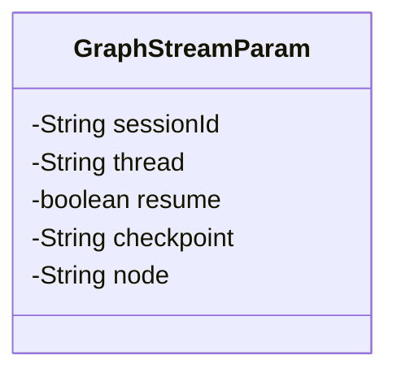
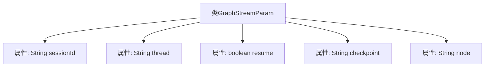

# 基础信息

|      |      |
|------|------|
| 名称 | GraphStreamParam |
| 编码语言 | .java |
| 代码路径 | spring-ai-alibaba/spring-ai-alibaba-studio/src/main/java/com/alibaba/cloud/ai/param/GraphStreamParam.java |
| 包名 | com.alibaba.cloud.ai.param |
| 依赖项 | ['lombok.Data'] |
| 概述说明 | GraphStreamParam类含会话ID、线程、恢复标志、检查点和节点属性。 |

# 说明

GraphStreamParam类是一个用于管理会话和线程相关参数的类。它包含会话ID，用于唯一标识一个会话；线程信息，用于处理并发操作；恢复标志，用于指示是否需要恢复之前的状态；检查点，用于保存和恢复会话的关键状态；以及节点属性，用于存储与节点相关的配置和数据。这些参数共同确保会话的连续性和数据的一致性。

# 类列表 Class Summary

| 名称   | 类型  | 说明 |
|-------|------|-------------|
| GraphStreamParam | class | GraphStreamParam类包含会话ID、线程、恢复标志、检查点和节点属性。 |

## 类 GraphStreamParam

|      |      |
|------|------|
| 访问范围 | @Data;public |
| 类型 | class |
| 名称 | GraphStreamParam |
| 说明 | GraphStreamParam类包含会话ID、线程、恢复标志、检查点和节点属性。 |

### UML类图

这段代码定义了一个名为 `GraphStreamParam` 的类，该类包含五个私有成员变量：`sessionId`、`thread`、`resume`、`checkpoint` 和 `node`。这些变量可能用于存储与图形流处理相关的参数信息。`sessionId` 可能用于标识会话，`thread` 可能用于标识线程，`resume` 可能用于指示是否恢复处理，`checkpoint` 可能用于存储检查点信息，`node` 可能用于标识节点。由于使用了 `@Data` 注解，该类可能自动生成了相应的 getter 和 setter 方法，但这些方法在类图中未显式展示。

### 内部方法调用关系图

这段代码定义了一个名为 `GraphStreamParam` 的类，该类包含五个私有属性：`sessionId`、`thread`、`resume`、`checkpoint` 和 `node`。这些属性分别用于存储会话ID、线程信息、是否恢复的标志、检查点信息和节点信息。该类使用了 `@Data` 注解，这意味着它会自动生成getter、setter、toString、equals和hashCode等方法，从而简化了代码的编写和维护。

### 字段列表 Field List

| 名称  | 类型  | 说明 |
|-------|-------|------|
| thread | String | 声明了一个私有的字符串变量thread。 |
| checkpoint | String | 定义了一个私有字符串变量checkpoint。 |
| resume | boolean | 定义了一个私有的布尔类型变量resume。 |
| sessionId | String | 声明一个私有的字符串类型变量sessionId。 |
| node | String | 定义了一个私有字符串变量node。 |

### 方法列表 Method List

| 名称  | 类型  | 说明 |
|-------|-------|------|

