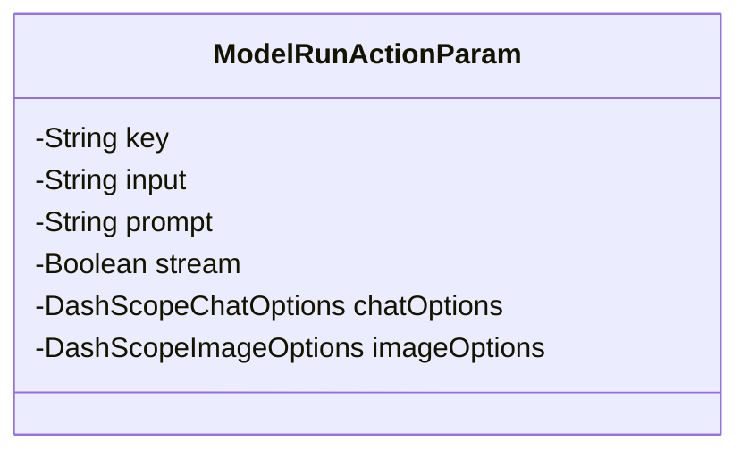
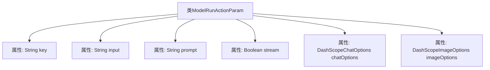

# 基础信息

|      |      |
|------|------|
| 名称 | ModelRunActionParam |
| 编码语言 | .java |
| 代码路径 | spring-ai-alibaba/spring-ai-alibaba-studio/src/main/java/com/alibaba/cloud/ai/param/ModelRunActionParam.java |
| 包名 | com.alibaba.cloud.ai.param |
| 依赖项 | ['com.alibaba.cloud.ai.dashscope.chat.DashScopeChatOptions', 'com.alibaba.cloud.ai.dashscope.image.DashScopeImageOptions', 'io.swagger.v3.oas.annotations.media.Schema', 'lombok.Data'] |
| 概述说明 | ModelRunActionParam类包含键、输入、提示、流响应和模型配置参数。 |

# 说明

ModelRunActionParam类是一个用于定义模型运行操作的参数集合，主要包含键、输入、提示、流响应和模型配置参数。这些参数共同构成了模型运行时的完整配置，确保模型能够根据指定的输入和提示生成相应的流响应，并通过模型配置参数进一步优化和控制运行过程。

# 类列表 Class Summary

| 名称   | 类型  | 说明 |
|-------|------|-------------|
| ModelRunActionParam | class | ModelRunActionParam类包含键、输入、提示、流响应及模型配置参数。 |

## 类 ModelRunActionParam

|      |      |
|------|------|
| 访问范围 | @Data;public |
| 类型 | class |
| 名称 | ModelRunActionParam |
| 说明 | ModelRunActionParam类包含键、输入、提示、流响应及模型配置参数。 |

### UML类图

这段代码定义了一个名为 `ModelRunActionParam` 的类，该类用于封装模型运行时的参数。类中包含多个私有属性，分别表示操作键、用户输入、系统提示、是否使用流式响应、聊天模型配置和图像模型配置。这些属性通过 `@Schema` 注解进行描述，提供了详细的文档说明。类图清晰地展示了类的结构及其私有成员。

### 内部方法调用关系图

这段代码定义了一个名为`ModelRunActionParam`的类，包含了多个属性，分别用于存储动作键、用户输入、系统提示、流式响应标志、聊天模型配置和图像模型配置。每个属性都通过`@Schema`注解进行了详细的描述，包括默认值和是否可为空。这个类主要用于封装模型运行时的参数，便于在程序中进行传递和处理。

### 字段列表 Field List

| 名称  | 类型  | 说明 |
|-------|-------|------|
| prompt | String | 系统提示信息的描述字段。 |
| chatOptions | DashScopeChatOptions | 聊天模型配置，包含可空的DashScopeChatOptions属性。 |
| imageOptions | DashScopeImageOptions | 图像模型配置，包含DashScope图像选项，可为空。 |
| key | String | 动作键与Bean名称对应，如chatModel对应chatClient。 |
| input | String | 用户输入字段定义为字符串类型。 |
| stream = Boolean.FALSE | Boolean | 使用流式响应，默认值为false。 |

### 方法列表 Method List

| 名称  | 类型  | 说明 |
|-------|-------|------|

