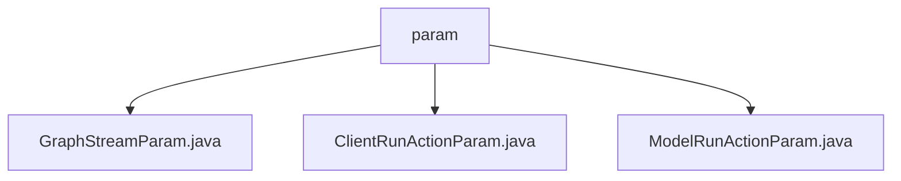

# 基础信息

|      |      |
|------|------|
| 名称 | param |
| 编码语言 | .java |
| 代码路径 | spring-ai-alibaba/spring-ai-alibaba-studio/src/main/java/com/alibaba/cloud/ai/param |
| 包名 | spring-ai-alibaba.spring-ai-alibaba-studio.src.main.java.com.alibaba.cloud.ai.param |
| 概述说明 | GraphStreamParam类管理会话和线程参数，确保数据一致性。ClientRunActionParam类管理客户端操作参数，支持实时数据传输。ModelRunActionParam类定义模型运行参数，优化运行过程。 |

# 说明

## 概述
该代码模块主要包含三个核心类，分别用于管理会话和线程相关参数、客户端操作参数以及模型运行操作参数。这些类共同协作，确保会话的连续性、数据的一致性以及客户端和模型的高效运行。模块的设计旨在支持并发操作、实时数据传输和模型优化控制，适用于需要处理复杂会话和模型交互的业务场景。

## 主要业务场景
1. **会话管理**：通过`GraphStreamParam`类，模块能够唯一标识会话、处理并发操作、恢复会话状态以及保存和恢复关键状态。适用于需要长时间保持会话连续性和数据一致性的场景，如在线客服、实时数据分析等。
  
2. **客户端操作管理**：`ClientRunActionParam`类用于管理客户端操作的关键参数，包括操作类型、用户输入、系统提示、聊天会话标识、实时数据传输和聊天模型配置。适用于需要高效执行客户端任务并实时响应用户交互的场景，如聊天机器人、智能助手等。

3. **模型运行管理**：`ModelRunActionParam`类定义了模型运行时的完整配置，包括键、输入、提示、流响应和模型配置参数。适用于需要根据特定输入和提示生成流响应，并通过模型配置参数优化运行过程的场景，如自然语言处理、图像识别等。

这些类通过紧密协作，为复杂的会话管理、客户端操作和模型运行提供了强大的支持，适用于多种需要高效、准确和实时处理的业务场景。

### 包内部结构视图

该流程图展示了`param`目录下的三个Java文件：`GraphStreamParam.java`、`ClientRunActionParam.java`和`ModelRunActionParam.java`。`param`作为根节点，直接连接到这三个文件，清晰地反映了它们之间的层级关系。这种结构有助于开发者快速理解项目中的文件组织方式。

# 文件列表 File List

| 名称   | 类型  | 说明 |
|-------|------|-------------|
| [GraphStreamParam.java](GraphStreamParam.md) | file | GraphStreamParam类含会话ID、线程、恢复标志、检查点和节点属性。 |
| [ModelRunActionParam.java](ModelRunActionParam.md) | file | ModelRunActionParam类包含键、输入、提示、流响应和模型配置参数。 |
| [ClientRunActionParam.java](ClientRunActionParam.md) | file | 客户端运行参数类包含操作键、用户输入、系统提示、聊天ID、流式响应和模型配置。 |

