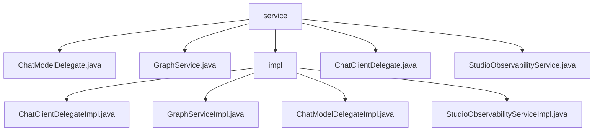

# 基础信息

|      |      |
|------|------|
| 名称 | service |
| 编码语言 | .java |
| 代码路径 | spring-ai-alibaba/spring-ai-alibaba-studio/src/main/java/com/alibaba/cloud/ai/service |
| 包名 | spring-ai-alibaba.spring-ai-alibaba-studio.src.main.java.com.alibaba.cloud.ai.service |
| 概述说明 | 该模块涉及聊天客户端、图数据、模型和日志管理，确保系统高效稳定运行。 |

# 说明

## 概述
该代码模块主要围绕聊天客户端、图数据处理、模型管理和日志管理等功能展开。模块中的各个实现类分别负责不同的业务场景，通过接口的统一管理，确保系统的高效稳定运行。模块涵盖了聊天客户端的管理、图数据的序列化与流式传输、模型的获取与运行、以及日志的导出与清理等功能，整体设计旨在提升系统的可维护性和运行效率。

## 主要业务场景
1. **聊天客户端管理**：`ChatClientDelegateImpl`类实现了`ChatClientDelegate`接口，负责聊天客户端的列表获取、运行控制、内存管理和模型配置，确保聊天客户端的高效稳定运行。
2. **图数据处理**：`GraphServiceImpl`类实现了`GraphService`接口，负责图数据的序列化、流式传输和状态管理，确保图数据在传输和存储过程中的完整性和一致性。
3. **模型管理**：`ChatModelDelegateImpl`类实现了`ChatModelDelegate`接口，负责`ChatModel`和`ImageModel`的获取、运行及结果返回，统一管理不同类型的模型，提升系统的运行效率和可维护性。
4. **日志管理**：`StudioObservabilityServiceImpl`类提供了日志导出、读取和清理等核心功能，支持对JSON格式的数据进行处理，并具备文件操作能力，确保系统的可观测性和日志数据的完整性。

### 包内部结构视图

该流程图展示了`service`目录及其子目录`impl`中的文件层级关系。`service`目录下包含多个Java文件，如`ChatModelDelegate.java`和`GraphService.java`，而`impl`目录则包含这些文件的实现类，如`ChatClientDelegateImpl.java`和`GraphServiceImpl.java`。整体结构清晰地反映了服务接口及其实现类的组织方式。

# 文件列表 File List

| 名称   | 类型  | 说明 |
|-------|------|-------------|
| [StudioObservabilityService.java](StudioObservabilityService.md) | file | 信息为空，无法生成概要描述。 |
| [ChatClientDelegate.java](ChatClientDelegate.md) | file | 无内容可总结。 |
| [GraphService.java](GraphService.md) | file | 无内容可总结。 |
| [ChatModelDelegate.java](ChatModelDelegate.md) | file | 无内容提供，无法生成概要描述。 |
| [impl](impl/_module.md) | package | ChatClientDelegateImpl管理聊天客户端，GraphServiceImpl处理图数据，ChatModelDelegateImpl协调模型操作，StudioObservabilityServiceImpl管理日志。 |

