# 基础信息

|      |      |
|------|------|
| 名称 | ChatClientDelegateImpl |
| 编码语言 | .java |
| 代码路径 | spring-ai-alibaba/spring-ai-alibaba-studio/src/main/java/com/alibaba/cloud/ai/service/impl/ChatClientDelegateImpl.java |
| 包名 | com.alibaba.cloud.ai.service.impl |
| 依赖项 | ['com.alibaba.cloud.ai.common.ModelType', 'com.alibaba.cloud.ai.dashscope.chat.DashScopeChatModel', 'com.alibaba.cloud.ai.dashscope.chat.DashScopeChatOptions', 'com.alibaba.cloud.ai.exception.ServiceInternalException', 'com.alibaba.cloud.ai.model.ChatClient', 'com.alibaba.cloud.ai.param.ClientRunActionParam', 'com.alibaba.cloud.ai.service.ChatClientDelegate', 'com.alibaba.cloud.ai.utils.SpringApplicationUtil', 'com.alibaba.cloud.ai.vo.ActionResult', 'com.alibaba.cloud.ai.vo.ChatClientRunResult', 'com.alibaba.cloud.ai.vo.TelemetryResult', 'com.github.benmanes.caffeine.cache.Cache', 'com.github.benmanes.caffeine.cache.Caffeine', 'io.micrometer.tracing.Tracer', 'java.lang.reflect.Field', 'java.util.ArrayList', 'java.util.List', 'java.util.Map', 'java.util.UUID', 'java.util.concurrent.TimeUnit', 'lombok.extern.slf4j.Slf4j', 'org.springframework.ai.chat.client.DefaultChatClient', 'org.springframework.ai.chat.client.advisor.AbstractChatMemoryAdvisor', 'org.springframework.ai.chat.client.advisor.MessageChatMemoryAdvisor', 'org.springframework.ai.chat.client.advisor.api.Advisor', 'org.springframework.ai.chat.memory.ChatMemory', 'org.springframework.ai.chat.memory.InMemoryChatMemory', 'org.springframework.ai.chat.model.ChatModel', 'org.springframework.stereotype.Service', 'org.springframework.util.ReflectionUtils', 'org.springframework.util.StringUtils', 'org.springframework.ai.chat.client.advisor.AbstractChatMemoryAdvisor.CHAT_MEMORY_CONVERSATION_ID_KEY', 'org.springframework.ai.chat.client.advisor.AbstractChatMemoryAdvisor.CHAT_MEMORY_RETRIEVE_SIZE_KEY'] |
| 概述说明 | ChatClientDelegateImpl实现接口，提供聊天客户端管理及运行功能，支持内存与模型配置。 |

# 说明

ChatClientDelegateImpl类实现了ChatClientDelegate接口，主要负责聊天客户端的管理和操作。该类提供了聊天客户端的列表获取、运行控制等功能，同时支持内存管理和模型配置，确保系统高效稳定运行。

# 类列表 Class Summary

| 名称   | 类型  | 说明 |
|-------|------|-------------|
| ChatClientDelegateImpl | class | ChatClientDelegateImpl实现ChatClientDelegate接口，提供聊天客户端列表、获取和运行功能，支持内存管理和模型配置。 |

## 类 ChatClientDelegateImpl

|      |      |
|------|------|
| 访问范围 | @Service;@Slf4j;public |
| 类型 | class |
| 名称 | ChatClientDelegateImpl |
| 说明 | ChatClientDelegateImpl实现ChatClientDelegate接口，提供聊天客户端列表、获取和运行功能，支持内存管理和模型配置。 |

### UML类图

```mermaid
classDiagram
    class ChatClientDelegateImpl {
        -Tracer tracer
        +ChatClientDelegateImpl(Tracer tracer)
        +List~ChatClient~ list()
        +ChatClient get(String clientName)
        +ChatClientRunResult run(ClientRunActionParam runActionParam)
        -org.springframework.ai.chat.client.ChatClient getChatClientByBeanName(String clientName)
        -ChatClient getChatClientVo(org.springframework.ai.chat.client.ChatClient chatClient, String clientName)
    }

    class ChatClientDelegate {
        <<Interface>>
        +List~ChatClient~ list()
        +ChatClient get(String clientName)
        +ChatClientRunResult run(ClientRunActionParam runActionParam)
    }

    class Tracer {
        +SpanContext currentSpan()
    }

    class ChatClient {
        +String name
        +String defaultSystemText
        +Map~String, Object~ defaultSystemParams
        +ChatOptions chatOptions
        +List~Advisor~ advisors
        +Boolean isMemoryEnabled
        +com.alibaba.cloud.ai.model.ChatModel chatModel
    }

    class ChatClientRunResult {
        +ClientRunActionParam input
        +ActionResult result
        +String ChatID
        +TelemetryResult telemetry
    }

    class ClientRunActionParam {
        +String key
        +String input
        +String prompt
        +DashScopeChatOptions chatOptions
        +String chatID
    }

    class ActionResult {
        +String Response
    }

    class TelemetryResult {
        +String traceId
    }

    class DashScopeChatOptions {
        // DashScopeChatOptions properties
    }

    class DefaultChatClient {
        +DefaultChatClientRequestSpec defaultChatClientRequest
    }

    class DefaultChatClientRequestSpec {
        +String systemText
        +Map~String, Object~ systemParams
        +ChatOptions chatOptions
        +List~Advisor~ advisors
    }

    class ChatModel {
        +String model
        +ModelType modelType
        +ChatOptions getDefaultOptions()
    }

    class DashScopeChatModel {
        +DashScopeChatOptions getDashScopeChatOptions()
    }

    class Advisor {
        // Advisor properties
    }

    class AbstractChatMemoryAdvisor {
        // AbstractChatMemoryAdvisor properties
    }

    ChatClientDelegateImpl --> ChatClientDelegate : 实现
    ChatClientDelegateImpl --> Tracer : 依赖
    ChatClientDelegateImpl --> ChatClient : 生成
    ChatClientDelegateImpl --> ChatClientRunResult : 生成
    ChatClientDelegateImpl --> ClientRunActionParam : 处理
    ChatClientDelegateImpl --> DefaultChatClient : 处理
    ChatClientDelegateImpl --> ChatModel : 处理
    ChatClientDelegateImpl --> DashScopeChatModel : 处理
    ChatClientDelegateImpl --> Advisor : 处理
    ChatClientDelegateImpl --> AbstractChatMemoryAdvisor : 处理
    ChatClientRunResult --> ClientRunActionParam : 包含
    ChatClientRunResult --> ActionResult : 包含
    ChatClientRunResult --> TelemetryResult : 包含
    DefaultChatClient --> DefaultChatClientRequestSpec : 包含
    ChatModel --> DashScopeChatModel : 继承
    Advisor --> AbstractChatMemoryAdvisor : 继承
```

这段代码描述了一个`ChatClientDelegateImpl`类，它实现了`ChatClientDelegate`接口，并提供了与聊天客户端相关的功能。该类通过`Tracer`进行跟踪，并能够列出、获取和运行聊天客户端。代码中还涉及了多个辅助类，如`ChatClient`、`ChatClientRunResult`、`ClientRunActionParam`等，用于处理聊天客户端的各种操作和结果。`DefaultChatClient`和`ChatModel`等类用于处理聊天客户端的内部逻辑和配置。整体结构复杂，涉及多个类的协作和依赖关系。

### 内部方法调用关系图

```mermaid
graph TD
    A["类ChatClientDelegateImpl"]
    B["属性: Tracer tracer"]
    C["常量: CHAT_MEMORY_RETRIEVE_SIZE = 100"]
    D["构造方法: ChatClientDelegateImpl(Tracer tracer)"]
    E["方法: List<ChatClient> list()"]
    F["方法: ChatClient get(String clientName)"]
    G["方法: ChatClientRunResult run(ClientRunActionParam runActionParam)"]
    H["私有方法: org.springframework.ai.chat.client.ChatClient getChatClientByBeanName(String clientName)"]
    I["私有方法: ChatClient getChatClientVo(org.springframework.ai.chat.client.ChatClient chatClient, String clientName)"]

    A --> B
    A --> C
    A --> D
    A --> E
    A --> F
    A --> G
    A --> H
    A --> I

    E --> J["获取ChatClient Map: SpringApplicationUtil.getBeans(org.springframework.ai.chat.client.ChatClient.class)"]
    E --> K["遍历Map: for (Map.Entry<String, org.springframework.ai.chat.client.ChatClient> entry : chatClientMap.entrySet())"]
    K --> L["记录日志: log.info('bean name:{}, bean Class:{}', entry.getKey(), chatClient.getClass())"]
    K --> M["调用getChatClientVo: getChatClientVo(chatClient, entry.getKey())"]
    M --> N["添加结果: res.add(client)"]

    F --> O["调用getChatClientByBeanName: getChatClientByBeanName(clientName)"]
    F --> P["调用getChatClientVo: getChatClientVo(chatClient, clientName)"]

    G --> Q["获取参数: key, input, prompt, chatOptions"]
    G --> R["调用getChatClientByBeanName: getChatClientByBeanName(key)"]
    G --> S["构建请求: chatClient.prompt()"]
    S --> T["设置系统提示: clientRequestSpec.system(prompt)"]
    S --> U["设置选项: clientRequestSpec.options(chatOptions)"]
    G --> V["生成会话ID: chatID = UUID.randomUUID().toString()"]
    G --> W["设置会话参数: clientRequestSpec.advisors(spec -> spec.param(CHAT_MEMORY_CONVERSATION_ID_KEY, finalChatID).param(CHAT_MEMORY_RETRIEVE_SIZE_KEY, CHAT_MEMORY_RETRIEVE_SIZE))"]
    G --> X["执行请求: clientRequestSpec.user(input).call().content()"]
    G --> Y["构建结果: ChatClientRunResult.builder().input(runActionParam).result(ActionResult.builder().Response(resp).build()).ChatID(chatID).telemetry(TelemetryResult.builder().traceId(tracer.currentSpan().context().traceId()).build()).build()"]

    I --> Z["构建ChatClient: ChatClient.builder().name(clientName).build()"]
    I --> AA["检查类型: if (chatClient.getClass() == DefaultChatClient.class)"]
    AA --> AB["反射获取字段: ReflectionUtils.findField(DefaultChatClient.class, 'defaultChatClientRequest')"]
    AB --> AC["设置字段值: client.setDefaultSystemText(defaultChatClientRequest.getSystemText())"]
    AB --> AD["设置字段值: client.setDefaultSystemParams(defaultChatClientRequest.getSystemParams())"]
    AB --> AE["设置字段值: client.setChatOptions(defaultChatClientRequest.getChatOptions())"]
    AB --> AF["设置字段值: client.setAdvisors(defaultChatClientRequest.getAdvisors())"]
    AB --> AG["检查是否开启memory: client.setIsMemoryEnabled(AbstractChatMemoryAdvisor.class.isAssignableFrom(clazz))"]
    AB --> AH["反射获取ChatModel: ReflectionUtils.findField(DefaultChatClient.DefaultChatClientRequestSpec.class, 'chatModel')"]
    AH --> AI["设置ChatModel: client.setChatModel(model)"]
```

这段代码描述了一个名为`ChatClientDelegateImpl`的类，它实现了`ChatClientDelegate`接口。该类主要负责管理与`ChatClient`相关的操作，包括列出所有`ChatClient`实例、根据名称获取特定`ChatClient`实例以及执行`ChatClient`的请求操作。代码中使用了反射技术来获取和设置`DefaultChatClient`的内部字段，并处理与`ChatModel`相关的逻辑。流程图展示了类内部方法的调用关系，以及每个方法的具体执行步骤。

### 字段列表 Field List

| 名称  | 类型  | 说明 |
|-------|-------|------|
| tracer | Tracer | 私有且不可变的Tracer对象。 |
| CHAT_MEMORY_RETRIEVE_SIZE = 100 | int | 定义常量CHAT_MEMORY_RETRIEVE_SIZE，值为100。 |

### 方法列表 Method List

| 名称  | 类型  | 说明 |
|-------|-------|------|
| get | ChatClient | 通过客户端名称获取并返回ChatClient实例。 |
| list | List<ChatClient> | 方法获取ChatClient实例并转换为VO对象，返回列表。 |
| getChatClientByBeanName | org.springframework.ai.chat.client.ChatClient | 通过Bean名称获取Spring AI聊天客户端实例。 |
| getChatClientVo | ChatClient | 创建ChatClient对象，设置系统文本、参数、选项和顾问，检查内存启用状态，并配置聊天模型。 |
| run | ChatClientRunResult | 方法运行聊天客户端，处理输入、提示和选项，生成响应并返回结果。 |

