# 基础信息

|      |      |
|------|------|
| 名称 | ChatModelDelegateImpl |
| 编码语言 | .java |
| 代码路径 | spring-ai-alibaba/spring-ai-alibaba-studio/src/main/java/com/alibaba/cloud/ai/service/impl/ChatModelDelegateImpl.java |
| 包名 | com.alibaba.cloud.ai.service.impl |
| 依赖项 | ['com.alibaba.cloud.ai.common.ModelType', 'com.alibaba.cloud.ai.dashscope.api.DashScopeApi', 'com.alibaba.cloud.ai.dashscope.api.DashScopeImageApi', 'com.alibaba.cloud.ai.dashscope.chat.DashScopeChatModel', 'com.alibaba.cloud.ai.dashscope.chat.DashScopeChatOptions', 'com.alibaba.cloud.ai.dashscope.image.DashScopeImageModel', 'com.alibaba.cloud.ai.dashscope.image.DashScopeImageOptions', 'com.alibaba.cloud.ai.exception.NotFoundException', 'com.alibaba.cloud.ai.model.ChatModel', 'com.alibaba.cloud.ai.param.ModelRunActionParam', 'com.alibaba.cloud.ai.service.ChatModelDelegate', 'com.alibaba.cloud.ai.utils.SpringApplicationUtil', 'com.alibaba.cloud.ai.vo.ActionResult', 'com.alibaba.cloud.ai.vo.ChatModelRunResult', 'com.alibaba.cloud.ai.vo.TelemetryResult', 'com.fasterxml.jackson.core.JsonProcessingException', 'com.fasterxml.jackson.databind.ObjectMapper', 'io.micrometer.tracing.Tracer', 'java.util.ArrayList', 'java.util.List', 'java.util.Map', 'lombok.extern.slf4j.Slf4j', 'org.springframework.ai.chat.messages.Message', 'org.springframework.ai.chat.messages.SystemMessage', 'org.springframework.ai.chat.messages.UserMessage', 'org.springframework.ai.chat.model.ChatResponse', 'org.springframework.ai.chat.prompt.Prompt', 'org.springframework.ai.image.ImageMessage', 'org.springframework.ai.image.ImageModel', 'org.springframework.ai.image.ImageOptions', 'org.springframework.ai.image.ImageOptionsBuilder', 'org.springframework.ai.image.ImagePrompt', 'org.springframework.ai.image.ImageResponse', 'org.springframework.stereotype.Service', 'org.springframework.util.StringUtils'] |
| 概述说明 | 实现ChatModelDelegate接口，处理模型获取、运行及结果返回。 |

# 说明

实现ChatModelDelegate接口的目的是处理ChatModel和ImageModel的获取、运行及结果返回。该接口负责协调和管理模型的相关操作，确保能够有效地获取所需模型，执行模型运行任务，并将处理结果准确返回。通过这一接口，系统能够统一管理不同类型的模型，提升整体运行效率和可维护性。

# 类列表 Class Summary

| 名称   | 类型  | 说明 |
|-------|------|-------------|
| ChatModelDelegateImpl | class | 实现ChatModelDelegate接口，处理ChatModel和ImageModel的获取、运行及结果返回。 |

## 类 ChatModelDelegateImpl

|      |      |
|------|------|
| 访问范围 | @Service;@Slf4j;public |
| 类型 | class |
| 名称 | ChatModelDelegateImpl |
| 说明 | 实现ChatModelDelegate接口，处理ChatModel和ImageModel的获取、运行及结果返回。 |

### UML类图

```mermaid
classDiagram
    class ChatModelDelegateImpl {
        -Tracer tracer
        -ObjectMapper objectMapper
        +ChatModelDelegateImpl(Tracer tracer)
        +List~ChatModel~ list()
        +ChatModel getByModelName(String modelName)
        +ChatModelRunResult run(ModelRunActionParam runActionParam)
        +String runImageGenTask(ModelRunActionParam runActionParam)
        +ChatModelRunResult runImageGenTaskAndGetUrl(ModelRunActionParam modelRunActionParam)
        +List~String~ listModelNames(ModelType modelType)
        -org.springframework.ai.chat.model.ChatModel getChatModel(String modelName)
        -ImageModel getImageModel(String modelName)
    }

    class ChatModelDelegate {
        <<Interface>>
        +List~ChatModel~ list()
        +ChatModel getByModelName(String modelName)
        +ChatModelRunResult run(ModelRunActionParam runActionParam)
        +String runImageGenTask(ModelRunActionParam runActionParam)
        +ChatModelRunResult runImageGenTaskAndGetUrl(ModelRunActionParam modelRunActionParam)
        +List~String~ listModelNames(ModelType modelType)
    }

    class ChatModel {
        +String name
        +String model
        +ModelType modelType
        +ChatOptions chatOptions
        +ImageOptions imageOptions
    }

    class ChatModelRunResult {
        +ModelRunActionParam input
        +ActionResult result
        +TelemetryResult telemetry
    }

    class ModelRunActionParam {
        +String key
        +String input
        +DashScopeChatOptions chatOptions
        +String prompt
    }

    class ActionResult {
        +String Response
    }

    class TelemetryResult {
        +String traceId
    }

    class DashScopeChatModel {
        +DashScopeChatOptions getDashScopeChatOptions()
        +void setDashScopeChatOptions(DashScopeChatOptions chatOptions)
    }

    class DashScopeImageModel {
        +DashScopeImageOptions getOptions()
        +void setOptions(DashScopeImageOptions options)
    }

    class SpringApplicationUtil {
        +Map~String, T~ getBeans(Class~T~ clazz)
    }

    class Tracer {
        +Span currentSpan()
    }

    class ObjectMapper {
        +String writeValueAsString(Object value)
    }

    ChatModelDelegateImpl --> ChatModelDelegate : 实现
    ChatModelDelegateImpl --> Tracer : 依赖
    ChatModelDelegateImpl --> ObjectMapper : 依赖
    ChatModelDelegateImpl --> SpringApplicationUtil : 依赖
    ChatModelDelegateImpl --> DashScopeChatModel : 依赖
    ChatModelDelegateImpl --> DashScopeImageModel : 依赖
    ChatModelDelegateImpl --> ChatModel : 依赖
    ChatModelDelegateImpl --> ChatModelRunResult : 依赖
    ChatModelDelegateImpl --> ModelRunActionParam : 依赖
    ChatModelDelegateImpl --> ActionResult : 依赖
    ChatModelDelegateImpl --> TelemetryResult : 依赖
```

### 描述
`ChatModelDelegateImpl` 类实现了 `ChatModelDelegate` 接口，负责管理不同类型的模型（如聊天模型、图像模型等）。它通过 `SpringApplicationUtil` 获取 Spring 容器中的模型实例，并根据模型类型执行相应的操作。`ChatModelDelegateImpl` 依赖于 `Tracer` 和 `ObjectMapper` 进行日志追踪和 JSON 序列化。它还处理模型的运行结果，生成 `ChatModelRunResult` 对象，并通过 `ModelRunActionParam` 传递运行参数。

### 内部方法调用关系图

该流程图展示了`ChatModelDelegateImpl`类的结构和主要方法。类包含两个属性`tracer`和`objectMapper`，以及一个构造方法和多个功能方法。这些方法包括获取聊天模型列表、根据模型名称获取模型、运行模型任务、生成图像任务等。每个方法通过箭头指向其功能描述，清晰地展示了类的内部结构和功能调用关系。

### 字段列表 Field List

| 名称  | 类型  | 说明 |
|-------|-------|------|
| tracer | Tracer | 私有且不可变的Tracer对象。 |
| objectMapper | ObjectMapper | 私有不可变的对象映射器实例。 |

### 方法列表 Method List

| 名称  | 类型  | 说明 |
|-------|-------|------|
| getChatModel | org.springframework.ai.chat.model.ChatModel | 通过模型名称获取Spring AI聊天模型实例。 |
| list | List<ChatModel> | 获取ChatModel和ImageModel列表，记录bean信息并构建返回结果。 |
| getByModelName | ChatModel | 根据模型名称获取ChatModel或ImageModel，若未找到则抛出异常。 |
| runImageGenTask | String | 方法处理图像生成任务，获取参数并调用模型生成图像，返回结果URL。 |
| listModelNames | List<String> | 根据模型类型返回对应模型名称列表。 |
| runImageGenTaskAndGetUrl | ChatModelRunResult | 该方法生成图像并返回URL，包含输入、结果和跟踪信息。 |
| run | ChatModelRunResult | 方法run根据参数获取模型，设置选项，生成消息并调用模型，返回结果。 |
| getImageModel | ImageModel | 私有方法通过模型名获取对应ImageModel实例，返回匹配实例或null。 |

