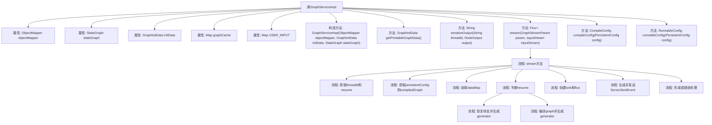

# 基础信息

|      |      |
|------|------|
| 名称 | GraphServiceImpl |
| 编码语言 | .java |
| 代码路径 | spring-ai-alibaba/spring-ai-alibaba-studio/src/main/java/com/alibaba/cloud/ai/service/impl/GraphServiceImpl.java |
| 包名 | com.alibaba.cloud.ai.service.impl |
| 依赖项 | ['com.alibaba.cloud.ai.graph.CompileConfig', 'com.alibaba.cloud.ai.graph.CompiledGraph', 'com.alibaba.cloud.ai.graph.NodeOutput', 'com.alibaba.cloud.ai.graph.PersistentConfig', 'com.alibaba.cloud.ai.graph.RunnableConfig', 'com.alibaba.cloud.ai.graph.StateGraph', 'com.alibaba.cloud.ai.graph.checkpoint.config.SaverConfig', 'com.alibaba.cloud.ai.graph.checkpoint.constant.SaverConstant', 'com.alibaba.cloud.ai.graph.checkpoint.savers.MemorySaver', 'com.alibaba.cloud.ai.graph.serializer.plain_text.PlainTextStateSerializer', 'com.alibaba.cloud.ai.graph.state.AgentState', 'com.alibaba.cloud.ai.param.GraphStreamParam', 'com.alibaba.cloud.ai.service.GraphService', 'com.alibaba.cloud.ai.graph.GraphInitData', 'com.fasterxml.jackson.core.type.TypeReference', 'com.fasterxml.jackson.databind.ObjectMapper', 'lombok.extern.slf4j.Slf4j', 'org.bsc.async.AsyncGenerator', 'org.springframework.http.codec.ServerSentEvent', 'org.springframework.stereotype.Service', 'reactor.core.publisher.Flux', 'reactor.core.publisher.Sinks', 'java.io.IOException', 'java.io.InputStream', 'java.io.InputStreamReader', 'java.io.PrintWriter', 'java.util.HashMap', 'java.util.Map', 'java.util.concurrent.CompletionException', 'java.util.concurrent.ConcurrentHashMap', 'java.util.concurrent.TimeUnit', 'java.util.Optional.ofNullable'] |
| 概述说明 | GraphServiceImpl实现GraphService，处理图数据序列化、流式传输和状态管理。 |

# 说明

GraphServiceImpl是GraphService的具体实现类，主要负责图数据的序列化、流式传输和状态管理。它通过实现GraphService接口，提供了对图数据的处理功能，确保数据在传输和存储过程中的完整性和一致性。该实现类在处理图数据时，能够有效地进行序列化操作，支持流式传输以提高数据传输效率，并管理图数据的状态，确保系统在处理图数据时的稳定性和可靠性。

# 类列表 Class Summary

| 名称   | 类型  | 说明 |
|-------|------|-------------|
| GraphServiceImpl | class | GraphServiceImpl实现GraphService，处理图数据序列化、流式传输和状态管理。 |


## 类 GraphServiceImpl

|      |      |
|------|------|
| 访问范围 | @Service;@Slf4j;public |
| 类型 | class |
| 名称 | GraphServiceImpl |
| 说明 | GraphServiceImpl实现GraphService，处理图数据序列化、流式传输和状态管理。 |


### UML类图

```mermaid
classDiagram
    class GraphServiceImpl {
        -ObjectMapper objectMapper
        -StateGraph stateGraph
        -GraphInitData initData
        -Map~PersistentConfig, CompiledGraph~ graphCache
        +Map~String, Object~ USER_INPUT
        +GraphServiceImpl(ObjectMapper objectMapper, GraphInitData initData, StateGraph stateGraph)
        +GraphInitData getPrintableGraphData()
        -String serializeOutput(String threadId, NodeOutput output)
        +Flux~ServerSentEvent~String~~ stream(GraphStreamParam param, InputStream inputStream) throws Exception
        -CompileConfig compileConfig(PersistentConfig config)
        -RunnableConfig runnableConfig(PersistentConfig config)
    }

    class GraphService {
        <<Interface>>
        +GraphInitData getPrintableGraphData()
        +Flux~ServerSentEvent~String~~ stream(GraphStreamParam param, InputStream inputStream) throws Exception
    }

    class ObjectMapper {
        +String writeValueAsString(Object value) throws JsonProcessingException
        +~T~ readValue(InputStream src, TypeReference~T~ valueTypeRef) throws IOException, JsonProcessingException
    }

    class StateGraph {
        +StateSerializer getStateSerializer()
        +CompiledGraph compile(CompileConfig config)
    }

    class GraphInitData {
        // Graph initialization data
    }

    class PersistentConfig {
        +String sessionId
        +String threadId
        +PersistentConfig(String sessionId, String threadId)
    }

    class CompiledGraph {
        +StateSnapshot getState(RunnableConfig config)
        +RunnableConfig updateState(RunnableConfig config, Map~String, Object~ dataMap, String node)
        +AsyncGenerator~NodeOutput~ streamSnapshots(Map~String, Object~ dataMap, RunnableConfig config)
    }

    class NodeOutput {
        // Node output data
    }

    class AsyncGenerator~T~ {
        +void forEachAsync(Consumer~T~ action)
    }

    class ServerSentEvent~T~ {
        +T data
        +ServerSentEvent~T~ builder(T data)
    }

    class Flux~T~ {
        // Reactive stream
    }

    class Sinks~T~ {
        +Sinks.Many~T~ many()
    }

    class RunnableConfig {
        +String threadId
        +String checkPointId
        +RunnableConfig builder()
    }

    class CompileConfig {
        +SaverConfig saverConfig
        +CompileConfig builder()
    }

    class SaverConfig {
        +void register(String key, Object saver)
        +SaverConfig builder()
    }

    class MemorySaver {
        // Memory saver implementation
    }

    class StateSerializer {
        <<Interface>>
        +Map~String, Object~ read(Reader reader)
    }

    class PlainTextStateSerializer {
        +Map~String, Object~ read(Reader reader)
    }

    GraphServiceImpl --> GraphService : 实现
    GraphServiceImpl --> ObjectMapper : 依赖
    GraphServiceImpl --> StateGraph : 依赖
    GraphServiceImpl --> GraphInitData : 依赖
    GraphServiceImpl --> PersistentConfig : 依赖
    GraphServiceImpl --> CompiledGraph : 依赖
    GraphServiceImpl --> NodeOutput : 依赖
    GraphServiceImpl --> AsyncGenerator~NodeOutput~ : 依赖
    GraphServiceImpl --> ServerSentEvent~String~ : 依赖
    GraphServiceImpl --> Flux~ServerSentEvent~String~~ : 依赖
    GraphServiceImpl --> Sinks~ServerSentEvent~String~~ : 依赖
    GraphServiceImpl --> RunnableConfig : 依赖
    GraphServiceImpl --> CompileConfig : 依赖
    GraphServiceImpl --> SaverConfig : 依赖
    GraphServiceImpl --> MemorySaver : 依赖
    GraphServiceImpl --> StateSerializer : 依赖
    GraphServiceImpl --> PlainTextStateSerializer : 依赖
    StateGraph --> StateSerializer : 依赖
    CompiledGraph --> RunnableConfig : 依赖
    CompiledGraph --> AsyncGenerator~NodeOutput~ : 依赖
    PlainTextStateSerializer --> StateSerializer : 实现
```

**描述：**
`GraphServiceImpl` 是一个服务类，实现了 `GraphService` 接口，主要负责处理图数据的初始化和流式传输。它依赖于 `ObjectMapper` 进行 JSON 序列化和反序列化，使用 `StateGraph` 管理图状态，并通过 `CompiledGraph` 生成节点输出流。`GraphServiceImpl` 还维护了一个缓存 `graphCache` 来存储已编译的图数据，并通过 `Flux` 和 `ServerSentEvent` 实现流式数据传输。


### 内部方法调用关系图



这段代码描述了一个名为`GraphServiceImpl`的服务类，该类实现了`GraphService`接口。代码的主要功能是通过`stream`方法处理图形数据流，支持恢复状态和生成异步数据流。流程图展示了类的属性、构造方法、主要方法及其内部调用关系，特别是`stream`方法的详细流程，包括获取参数、读取数据、判断是否恢复状态、生成数据流以及处理完成或错误的情况。

### 字段列表 Field List

| 名称  | 类型  | 说明 |
|-------|-------|------|
| objectMapper | ObjectMapper | 私有且不可变的ObjectMapper实例。 |
| initData | GraphInitData | 私有变量initData用于存储图初始化数据。 |
| USER_INPUT = new HashMap<>() | Map<String, Object> | 定义一个静态不可变的Map变量USER_INPUT，用于存储用户输入数据。 |
| graphCache = new ConcurrentHashMap<>() | Map<PersistentConfig, CompiledGraph> | 私有并发映射存储配置与编译图的缓存。 |
| stateGraph | StateGraph | 私有不可变状态图对象。 |

### 方法列表 Method List

| 名称  | 类型  | 说明 |
|-------|-------|------|
| compileConfig | CompileConfig | 该方法创建并返回一个包含内存保存器的编译配置对象。 |
| runnableConfig | RunnableConfig | 根据配置构建可运行配置，包含线程ID。 |
| serializeOutput | String | 将线程ID和节点输出序列化为JSON字符串，异常时记录错误并返回空字符串。 |
| stream | Flux<ServerSentEvent<String>> | 根据参数和输入流生成ServerSentEvent流，支持恢复和初始化两种模式。 |
| getPrintableGraphData | GraphInitData | 重写getPrintableGraphData方法，返回initData对象。 |


