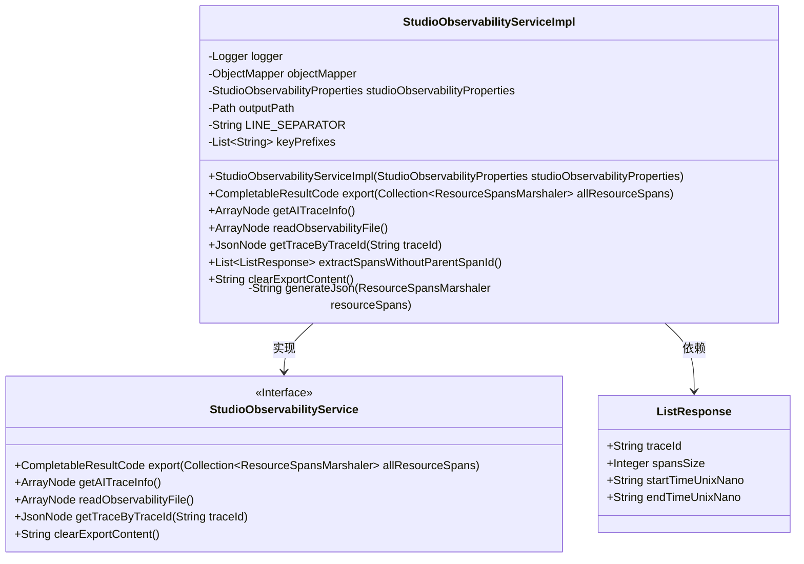

# 基础信息

|      |      |
|------|------|
| 名称 | StudioObservabilityServiceImpl |
| 编码语言 | .java |
| 代码路径 | spring-ai-alibaba/spring-ai-alibaba-studio/src/main/java/com/alibaba/cloud/ai/service/impl/StudioObservabilityServiceImpl.java |
| 包名 | com.alibaba.cloud.ai.service.impl |
| 依赖项 | ['com.alibaba.cloud.ai.exception.NotFoundException', 'com.alibaba.cloud.ai.oltp.StudioObservabilityProperties', 'com.alibaba.cloud.ai.service.StudioObservabilityService', 'com.alibaba.cloud.ai.utils.FileUtils', 'com.alibaba.cloud.ai.utils.JsonUtil', 'com.fasterxml.jackson.annotation.JsonInclude', 'com.fasterxml.jackson.annotation.JsonProperty', 'com.fasterxml.jackson.core.JsonGenerator', 'com.fasterxml.jackson.core.io.SegmentedStringWriter', 'com.fasterxml.jackson.databind.JsonNode', 'com.fasterxml.jackson.databind.ObjectMapper', 'com.fasterxml.jackson.databind.node.ArrayNode', 'io.opentelemetry.exporter.internal.otlp.traces.ResourceSpansMarshaler', 'io.opentelemetry.sdk.common.CompletableResultCode', 'java.io.BufferedWriter', 'java.io.IOException', 'java.nio.file.Files', 'java.nio.file.Path', 'java.nio.file.StandardOpenOption', 'java.util.ArrayList', 'java.util.Collection', 'java.util.List', 'java.util.logging.Level', 'java.util.logging.Logger'] |
| 概述说明 | StudioObservabilityServiceImpl类实现日志处理与文件操作功能。 |

# 说明

StudioObservabilityServiceImpl类是一个功能丰富的实现类，主要提供日志导出、读取和清理等核心功能。该类支持对JSON格式的数据进行处理，并具备文件操作能力，能够高效地管理和维护日志文件，确保系统的可观测性和日志数据的完整性。

# 类列表 Class Summary

| 名称   | 类型  | 说明 |
|-------|------|-------------|
| StudioObservabilityServiceImpl | class | StudioObservabilityServiceImpl类实现日志导出、读取和清理功能，支持JSON处理和文件操作。 |

## 类 StudioObservabilityServiceImpl

|      |      |
|------|------|
| 访问范围 | public |
| 类型 | class |
| 名称 | StudioObservabilityServiceImpl |
| 说明 | StudioObservabilityServiceImpl类实现日志导出、读取和清理功能，支持JSON处理和文件操作。 |

### UML类图

### 描述
`StudioObservabilityServiceImpl` 类实现了 `StudioObservabilityService` 接口，负责处理与可观察性相关的操作。它包含多个方法，如 `export` 用于将资源跨度导出到文件，`getAITraceInfo` 用于获取 AI 跟踪信息，`readObservabilityFile` 用于读取可观察性文件，`getTraceByTraceId` 用于根据跟踪 ID 获取跟踪信息，`extractSpansWithoutParentSpanId` 用于提取没有父跨度 ID 的跨度，以及 `clearExportContent` 用于清除导出内容。`ListResponse` 是一个记录类，用于存储跨度数据的响应信息。

### 内部方法调用关系图

```mermaid
graph TD
    A["类StudioObservabilityServiceImpl"]
    B["属性: Logger logger"]
    C["属性: ObjectMapper objectMapper"]
    D["属性: StudioObservabilityProperties studioObservabilityProperties"]
    E["属性: Path outputPath"]
    F["属性: String LINE_SEPARATOR"]
    G["属性: List<String> keyPrefixes"]
    H["构造方法: StudioObservabilityServiceImpl(StudioObservabilityProperties studioObservabilityProperties)"]
    I["方法: CompletableResultCode export(Collection<ResourceSpansMarshaler> allResourceSpans)"]
    J["方法: ArrayNode getAITraceInfo()"]
    K["方法: String generateJson(ResourceSpansMarshaler resourceSpans)"]
    L["方法: ArrayNode readObservabilityFile()"]
    M["方法: JsonNode getTraceByTraceId(String traceId)"]
    N["方法: List<ListResponse> extractSpansWithoutParentSpanId()"]
    O["方法: String clearExportContent()"]
    P["内部类: ListResponse"]

    A --> B
    A --> C
    A --> D
    A --> E
    A --> F
    A --> G
    A --> H
    A --> I
    A --> J
    A --> K
    A --> L
    A --> M
    A --> N
    A --> O
    A --> P
```

**描述：**
该流程图展示了 `StudioObservabilityServiceImpl` 类的结构及其内部方法之间的关系。类中包含多个属性和方法，如 `export`、`getAITraceInfo`、`generateJson` 等，这些方法用于处理与可观测性相关的数据操作。类中还定义了一个内部类 `ListResponse`，用于封装响应数据。每个方法都有其特定的功能，如导出数据、生成 JSON、读取文件等，流程图清晰地展示了这些方法之间的调用关系。

### 字段列表 Field List

| 名称  | 类型  | 说明 |
|-------|-------|------|
| outputPath | Path | 私有路径变量outputPath。 |
| objectMapper | ObjectMapper | 私有且不可变的ObjectMapper实例。 |
| logger = Logger.getLogger(StudioObservabilityServiceImpl.class.getName()) | Logger | StudioObservabilityServiceImpl类中定义了一个私有静态日志记录器。 |
| keyPrefixes = List.of("gen_ai.operation", "spring.ai") | List<String> | 定义了两个字符串前缀列表：gen_ai.operation和spring.ai。 |
| LINE_SEPARATOR = System.lineSeparator() | String | 定义静态常量LINE_SEPARATOR为系统换行符。 |
| studioObservabilityProperties | StudioObservabilityProperties | 私有不可变的Studio可观测性属性实例。 |

### 方法列表 Method List

| 名称  | 类型  | 说明 |
|-------|-------|------|
| extractSpansWithoutParentSpanId | List<ListResponse> | 提取无父SpanId的Span数据并返回列表。 |
| clearExportContent | String | 清除文件内容，成功返回提示，失败记录错误信息。 |
| getAITraceInfo | ArrayNode | 方法提取符合前缀条件的AI追踪信息并返回数组。 |
| export | CompletableResultCode | 方法导出资源跨度数据到文件，处理大文件写入并返回结果状态。 |
| getTraceByTraceId | JsonNode | 通过traceId查找并返回匹配的trace信息，未找到时抛出异常。 |
| readObservabilityFile | ArrayNode | 读取文件并解析JSON，返回数组节点，处理无效路径和JSON错误。 |
| generateJson | String | 生成JSON字符串的方法，处理异常并返回结果。 |

