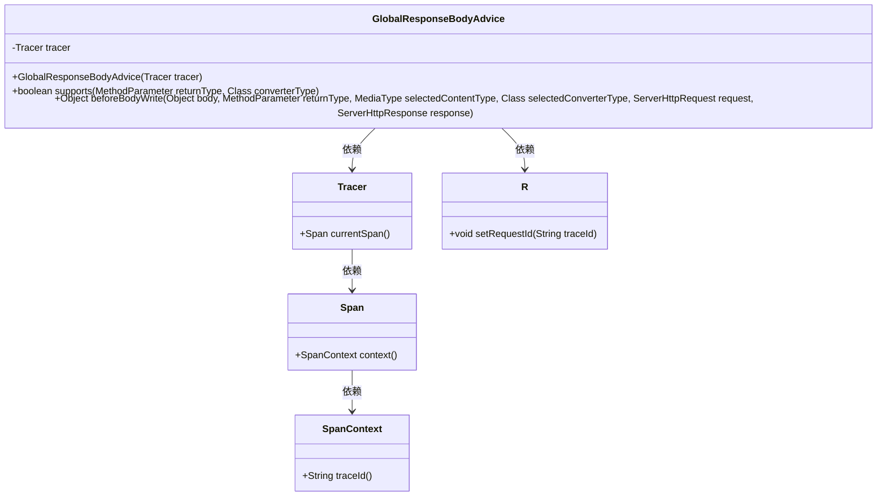
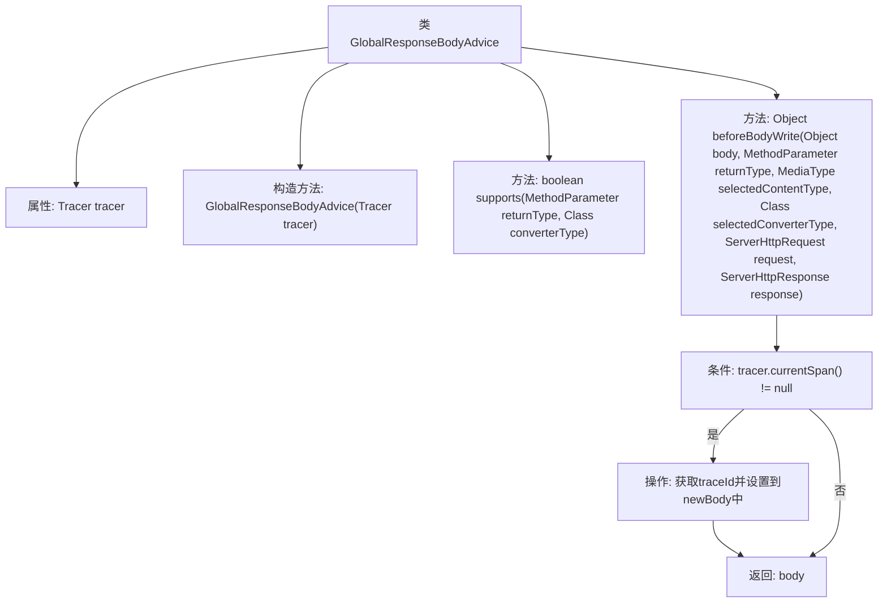

# 基础信息

|      |      |
|------|------|
| 名称 | GlobalResponseBodyAdvice |
| 编码语言 | .java |
| 代码路径 | spring-ai-alibaba/spring-ai-alibaba-studio/src/main/java/com/alibaba/cloud/ai/tracing/GlobalResponseBodyAdvice.java |
| 包名 | com.alibaba.cloud.ai.tracing |
| 依赖项 | ['com.alibaba.cloud.ai.common.R', 'io.micrometer.tracing.Tracer', 'java.util.Objects', 'org.springframework.core.MethodParameter', 'org.springframework.http.MediaType', 'org.springframework.http.server.ServerHttpRequest', 'org.springframework.http.server.ServerHttpResponse', 'org.springframework.web.bind.annotation.ControllerAdvice', 'org.springframework.web.servlet.mvc.method.annotation.ResponseBodyAdvice'] |
| 概述说明 | 全局响应体处理器将请求ID加入响应体。 |

# 说明

全局响应体处理器的主要功能是在每个响应体中添加请求ID。这一处理器的目的是为了在系统处理多个请求时，能够通过请求ID唯一标识每个请求，便于后续的跟踪和调试。通过这种方式，开发人员和运维团队可以更轻松地识别和解决与特定请求相关的问题，从而提高系统的可维护性和故障排查效率。

# 类列表 Class Summary

| 名称   | 类型  | 说明 |
|-------|------|-------------|
| GlobalResponseBodyAdvice | class | 全局响应体处理器，添加请求ID至响应体。 |

## 类 GlobalResponseBodyAdvice

|      |      |
|------|------|
| 访问范围 | @ControllerAdvice;public |
| 类型 | class |
| 名称 | GlobalResponseBodyAdvice |
| 说明 | 全局响应体处理器，添加请求ID至响应体。 |

### UML类图

**描述：**  
`GlobalResponseBodyAdvice` 是一个全局响应体处理器，实现了 `ResponseBodyAdvice` 接口。它通过 `Tracer` 获取当前请求的追踪信息，并在响应体中设置请求ID。`Tracer` 依赖于 `Span` 和 `SpanContext` 来获取追踪ID。`GlobalResponseBodyAdvice` 在处理响应体时，会检查 `R` 类型的返回值，并在其中设置请求ID。该类的核心功能是为响应体添加追踪信息，便于日志记录和调试。

### 内部方法调用关系图

这段代码定义了一个名为 `GlobalResponseBodyAdvice` 的类，它实现了 `ResponseBodyAdvice<Object>` 接口。该类通过 `supports` 方法判断是否需要处理返回值类型为 `R` 的响应体。在 `beforeBodyWrite` 方法中，如果当前存在 `tracer` 的 `span`，则获取 `traceId` 并将其设置到响应体中。最终返回修改后的响应体。该代码主要用于在响应体中添加请求追踪信息，以便于日志记录和调试。

### 字段列表 Field List

| 名称  | 类型  | 说明 |
|-------|-------|------|
| tracer | Tracer | 私有不可变的Tracer对象。 |

### 方法列表 Method List

| 名称  | 类型  | 说明 |
|-------|-------|------|
| supports | boolean | 方法检查返回类型是否为R类。 |
| beforeBodyWrite | Object | 方法在返回响应前检查当前跟踪ID，若存在则设置请求ID。 |

