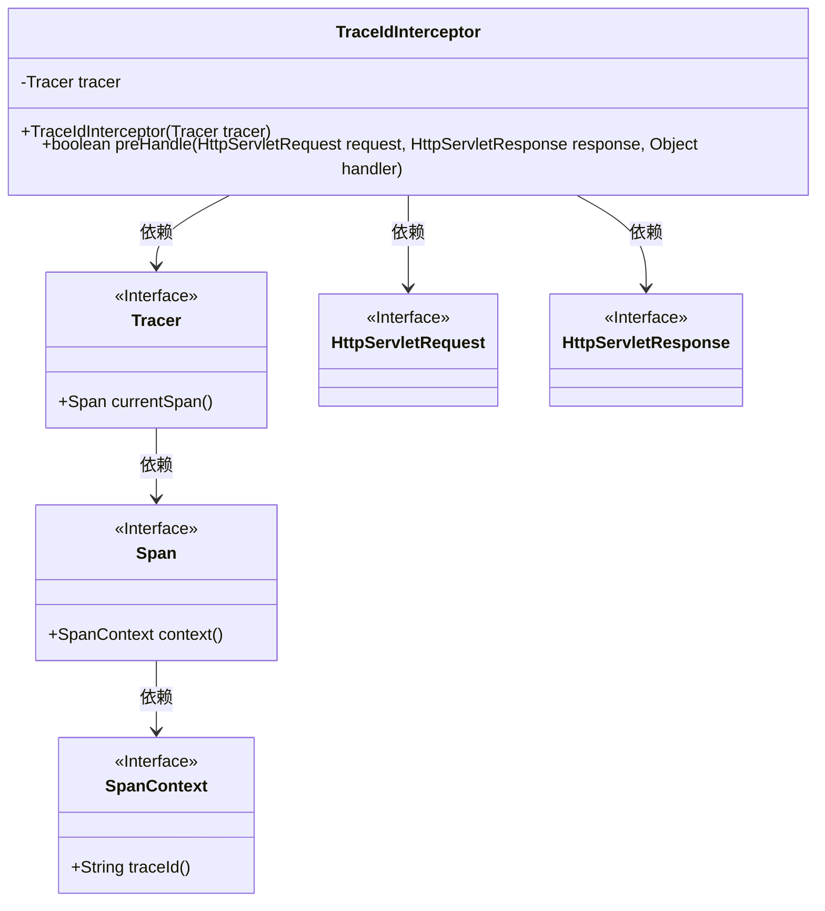
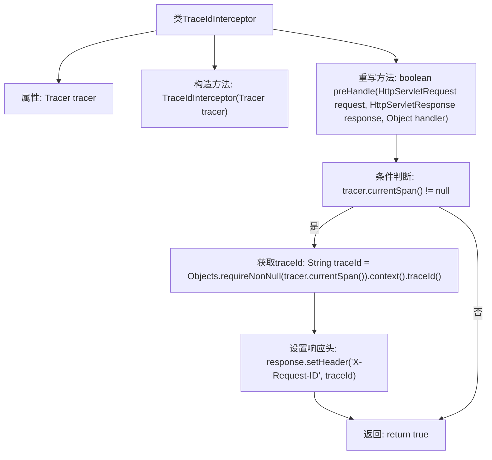

# 基础信息

|      |      |
|------|------|
| 名称 | TraceIdInterceptor |
| 编码语言 | .java |
| 代码路径 | spring-ai-alibaba/spring-ai-alibaba-studio/src/main/java/com/alibaba/cloud/ai/tracing/TraceIdInterceptor.java |
| 包名 | com.alibaba.cloud.ai.tracing |
| 依赖项 | ['io.micrometer.tracing.Tracer', 'jakarta.servlet.http.HttpServletRequest', 'jakarta.servlet.http.HttpServletResponse', 'java.util.Objects', 'lombok.extern.slf4j.Slf4j', 'org.springframework.stereotype.Component', 'org.springframework.web.servlet.HandlerInterceptor'] |
| 概述说明 | TraceIdInterceptor拦截器在请求处理前设置响应头X-Request-ID为当前追踪ID。 |

# 说明

TraceIdInterceptor拦截器在请求处理之前，将当前追踪ID设置为响应头X-Request-ID的值。这一操作确保了每个请求的追踪ID能够被记录并传递，便于后续的日志记录和问题排查。通过这种方式，系统能够更好地跟踪和识别每个请求的处理过程，提升系统的可观测性和调试效率。

# 类列表 Class Summary

| 名称   | 类型  | 说明 |
|-------|------|-------------|
| TraceIdInterceptor | class | TraceIdInterceptor拦截器在请求处理前设置响应头X-Request-ID为当前追踪ID。 |

## 类 TraceIdInterceptor

|      |      |
|------|------|
| 访问范围 | @Slf4j;@Component;public |
| 类型 | class |
| 名称 | TraceIdInterceptor |
| 说明 | TraceIdInterceptor拦截器在请求处理前设置响应头X-Request-ID为当前追踪ID。 |

### UML类图

**描述：**
`TraceIdInterceptor` 是一个实现了 `HandlerInterceptor` 接口的类，用于在请求处理前注入跟踪ID。它依赖于 `Tracer` 接口获取当前 `Span`，并通过 `Span` 获取 `SpanContext` 中的 `traceId`，最后将 `traceId` 设置为 HTTP 响应的头部信息。该类的核心方法 `preHandle` 负责处理请求和响应对象，并返回布尔值以决定是否继续处理请求。

### 内部方法调用关系图

这段代码定义了一个名为`TraceIdInterceptor`的类，该类实现了`HandlerInterceptor`接口。其主要功能是在请求处理前检查当前是否存在`Span`，如果存在，则从`Span`中提取`traceId`并将其设置为HTTP响应头`X-Request-ID`。代码通过`preHandle`方法实现这一逻辑，确保在请求处理过程中传递唯一的`traceId`，便于跟踪和调试。

### 字段列表 Field List

| 名称  | 类型  | 说明 |
|-------|-------|------|
| tracer | Tracer | 私有不可变的Tracer实例。 |

### 方法列表 Method List

| 名称  | 类型  | 说明 |
|-------|-------|------|
| preHandle | boolean | 方法preHandle检查当前Span，存在则设置响应头X-Request-ID为traceId，返回true。 |

