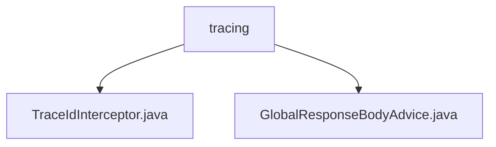

# 基础信息

|      |      |
|------|------|
| 名称 | tracing |
| 编码语言 | .java |
| 代码路径 | spring-ai-alibaba/spring-ai-alibaba-studio/src/main/java/com/alibaba/cloud/ai/tracing |
| 包名 | spring-ai-alibaba.spring-ai-alibaba-studio.src.main.java.com.alibaba.cloud.ai.tracing |
| 概述说明 | TraceIdInterceptor设置追踪ID，GlobalResponseBodyAdvice添加请求ID，便于日志记录和问题排查。 |

# 说明

## 概述
该代码模块主要涉及请求追踪和响应处理，旨在提升系统的可观测性和调试效率。通过拦截器和全局响应体处理器，模块确保了每个请求的追踪ID能够被记录并传递，便于后续的日志记录和问题排查。

## 主要业务场景
1. **请求追踪**：`TraceIdInterceptor`拦截器在请求处理之前，将当前追踪ID设置为响应头`X-Request-ID`的值。这一操作确保了每个请求的追踪ID能够被记录并传递，便于后续的日志记录和问题排查。
2. **响应处理**：`GlobalResponseBodyAdvice`全局响应体处理器在每个响应体中添加请求ID。这一处理器的目的是为了在系统处理多个请求时，能够通过请求ID唯一标识每个请求，便于后续的跟踪和调试。通过这种方式，开发人员和运维团队可以更轻松地识别和解决与特定请求相关的问题，从而提高系统的可维护性和故障排查效率。

### 包内部结构视图

该流程图展示了`tracing`文件夹下的两个文件`TraceIdInterceptor.java`和`GlobalResponseBodyAdvice.java`的层级关系。`tracing`作为根节点，包含这两个文件，表明它们位于同一目录下。这种结构常用于组织与追踪相关的代码文件，便于管理和维护。

# 文件列表 File List

| 名称   | 类型  | 说明 |
|-------|------|-------------|
| [TraceIdInterceptor.java](TraceIdInterceptor.md) | file | TraceIdInterceptor拦截器在请求处理前设置响应头X-Request-ID为当前追踪ID。 |
| [GlobalResponseBodyAdvice.java](GlobalResponseBodyAdvice.md) | file | 全局响应体处理器将请求ID加入响应体。 |

