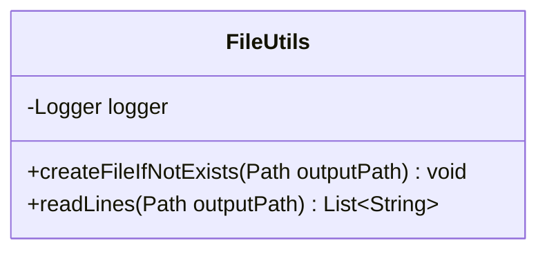
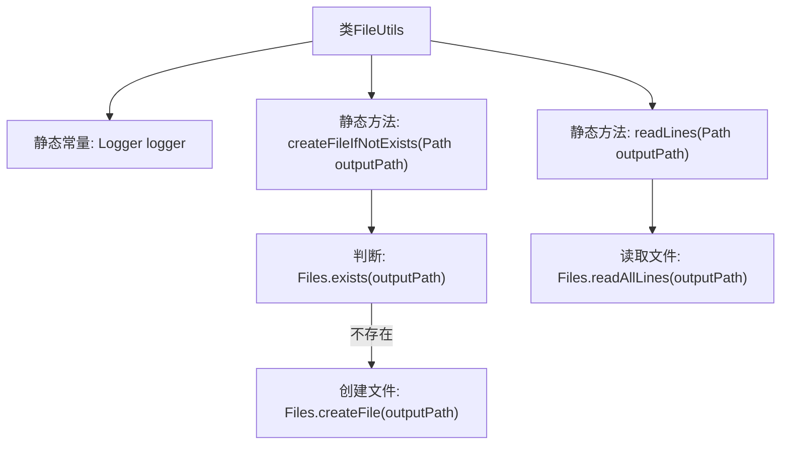

# 基础信息

|      |      |
|------|------|
| 名称 | FileUtils |
| 编码语言 | .java |
| 代码路径 | spring-ai-alibaba/spring-ai-alibaba-studio/src/main/java/com/alibaba/cloud/ai/utils/FileUtils.java |
| 包名 | com.alibaba.cloud.ai.utils |
| 依赖项 | ['java.io.IOException', 'java.nio.file.Files', 'java.nio.file.Path', 'java.util.List', 'java.util.logging.Logger'] |
| 概述说明 | FileUtils类用于创建和读取文件。 |

# 说明

FileUtils类是一个工具类，主要用于处理文件操作。它提供了创建文件和读取文件内容的功能。通过该类，用户可以方便地生成新文件，并获取已有文件中的数据。这些功能简化了文件管理任务，提高了开发效率。FileUtils类的设计旨在提供简单易用的接口，帮助开发者快速实现文件相关的操作。

# 类列表 Class Summary

| 名称   | 类型  | 说明 |
|-------|------|-------------|
| FileUtils | class | FileUtils类提供创建文件和读取文件内容的功能。 |

## 类 FileUtils

|      |      |
|------|------|
| 访问范围 | public |
| 类型 | class |
| 名称 | FileUtils |
| 说明 | FileUtils类提供创建文件和读取文件内容的功能。 |

### UML类图

**描述：**  
`FileUtils` 类是一个工具类，提供了文件操作的功能。它包含一个私有的 `Logger` 实例，用于记录日志。类中定义了两个公有静态方法：`createFileIfNotExists` 用于在指定路径下创建文件（如果文件不存在），`readLines` 用于读取指定文件的所有行并返回字符串列表。这些方法都可能会抛出 `IOException` 异常。

### 内部方法调用关系图

这段代码定义了一个名为 `FileUtils` 的工具类，包含两个静态方法：`createFileIfNotExists` 和 `readLines`。`createFileIfNotExists` 方法用于检查指定路径的文件是否存在，如果不存在则创建该文件；`readLines` 方法用于读取指定文件的所有行并返回一个字符串列表。代码中还定义了一个静态常量 `logger`，用于记录日志信息。流程图展示了类结构及其方法的调用关系。

### 字段列表 Field List

| 名称  | 类型  | 说明 |
|-------|-------|------|
| logger = Logger.getLogger(FileUtils.class.getName()) | Logger | 定义名为logger的静态常量日志记录器，用于FileUtils类。 |

### 方法列表 Method List

| 名称  | 类型  | 说明 |
|-------|-------|------|
| createFileIfNotExists | void | 检查文件路径是否存在，若不存在则创建文件。 |
| readLines | List<String> | 读取指定路径文件的所有行并返回字符串列表。 |

