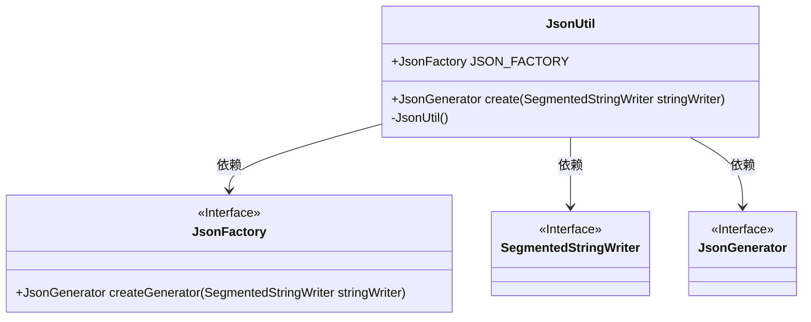
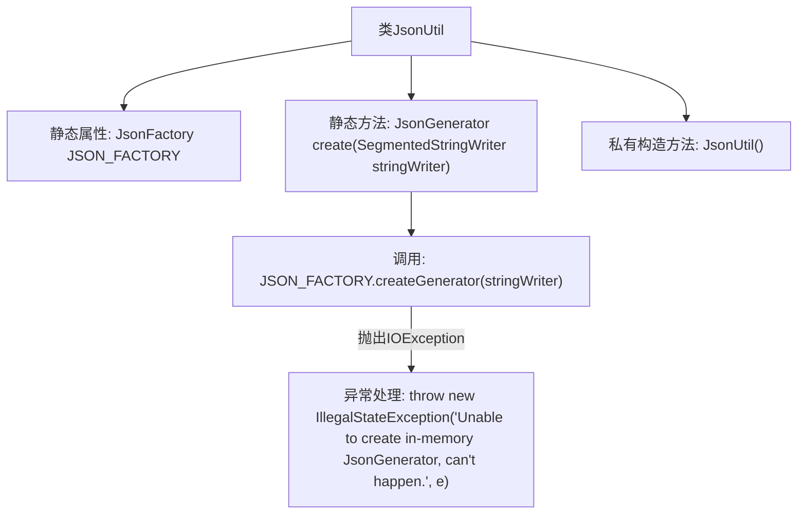

# 基础信息

|      |      |
|------|------|
| 名称 | JsonUtil |
| 编码语言 | .java |
| 代码路径 | spring-ai-alibaba/spring-ai-alibaba-studio/src/main/java/com/alibaba/cloud/ai/utils/JsonUtil.java |
| 包名 | com.alibaba.cloud.ai.utils |
| 依赖项 | ['com.fasterxml.jackson.core.JsonFactory', 'com.fasterxml.jackson.core.JsonGenerator', 'com.fasterxml.jackson.core.io.SegmentedStringWriter', 'java.io.IOException'] |
| 概述说明 | JsonUtil类提供静态方法生成内存中的JSON。 |

# 说明

JsonUtil类是一个工具类，主要提供静态方法来创建JsonGenerator对象，用于在内存中生成JSON数据。该类简化了JSON生成的过程，使开发者能够更方便地处理和操作JSON格式的数据。

# 类列表 Class Summary

| 名称   | 类型  | 说明 |
|-------|------|-------------|
| JsonUtil | class | JsonUtil类提供静态方法创建JsonGenerator，处理内存中的JSON生成。 |

## 类 JsonUtil

|      |      |
|------|------|
| 访问范围 | public final |
| 类型 | class |
| 名称 | JsonUtil |
| 说明 | JsonUtil类提供静态方法创建JsonGenerator，处理内存中的JSON生成。 |

### UML类图

这段代码定义了一个名为 `JsonUtil` 的工具类，用于创建 `JsonGenerator` 实例。`JsonUtil` 类包含一个静态的 `JsonFactory` 实例 `JSON_FACTORY`，并通过 `create` 方法生成 `JsonGenerator`。`create` 方法接受一个 `SegmentedStringWriter` 参数，并尝试使用 `JSON_FACTORY` 创建 `JsonGenerator`，如果发生 `IOException`，则抛出 `IllegalStateException`。`JsonUtil` 的构造函数被私有化，防止外部实例化。类图中展示了 `JsonUtil` 与 `JsonFactory`、`SegmentedStringWriter` 和 `JsonGenerator` 之间的依赖关系。

### 内部方法调用关系图

这段代码定义了一个名为`JsonUtil`的工具类，其中包含一个静态属性`JSON_FACTORY`和一个静态方法`create`。`create`方法尝试使用`JSON_FACTORY`创建一个`JsonGenerator`对象，如果发生`IOException`，则抛出`IllegalStateException`。类中的构造方法被私有化，以防止外部实例化。流程图展示了类的结构和方法调用关系，以及异常处理流程。

### 字段列表 Field List

| 名称  | 类型  | 说明 |
|-------|-------|------|
| JSON_FACTORY = new JsonFactory() | JsonFactory | 定义静态常量JSON_FACTORY，类型为JsonFactory。 |

### 方法列表 Method List

| 名称  | 类型  | 说明 |
|-------|-------|------|
| create | JsonGenerator | 创建基于SegmentedStringWriter的JsonGenerator，捕获IOException并抛出IllegalStateException。 |

