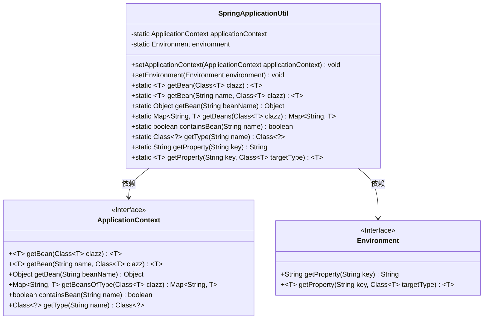

# 基础信息

|      |      |
|------|------|
| 名称 | SpringApplicationUtil |
| 编码语言 | .java |
| 代码路径 | spring-ai-alibaba/spring-ai-alibaba-studio/src/main/java/com/alibaba/cloud/ai/utils/SpringApplicationUtil.java |
| 包名 | com.alibaba.cloud.ai.utils |
| 依赖项 | ['java.util.Map', 'org.springframework.beans.BeansException', 'org.springframework.beans.factory.NoSuchBeanDefinitionException', 'org.springframework.context.ApplicationContext', 'org.springframework.context.ApplicationContextAware', 'org.springframework.context.EnvironmentAware', 'org.springframework.core.env.Environment', 'org.springframework.stereotype.Component'] |
| 概述说明 | Spring工具类管理应用上下文，支持获取Bean和配置项。 |

# 说明

Spring工具类主要用于管理应用上下文和环境配置，提供获取Bean和配置项的功能。它简化了应用程序的配置和管理过程，使开发者能够更方便地访问和管理Spring容器中的组件和配置信息。通过该工具类，开发者可以高效地获取所需的Bean实例和配置参数，从而提升开发效率和代码的可维护性。

# 类列表 Class Summary

| 名称   | 类型  | 说明 |
|-------|------|-------------|
| SpringApplicationUtil | class | Spring工具类，管理应用上下文和环境配置，支持获取Bean和配置项。 |

## 类 SpringApplicationUtil

|      |      |
|------|------|
| 访问范围 | @Component;public |
| 类型 | class |
| 名称 | SpringApplicationUtil |
| 说明 | Spring工具类，管理应用上下文和环境配置，支持获取Bean和配置项。 |

### UML类图

这段代码定义了一个名为 `SpringApplicationUtil` 的工具类，它实现了 `ApplicationContextAware` 和 `EnvironmentAware` 接口，用于获取 Spring 容器中的 Bean 实例和配置项。该类通过静态方法提供了从 Spring 容器中获取 Bean、检查 Bean 是否存在、获取 Bean 类型以及从环境配置中获取属性值等功能。`ApplicationContext` 和 `Environment` 是 Spring 框架中的接口，分别用于管理 Bean 和配置信息。`SpringApplicationUtil` 依赖于这两个接口来实现其功能。

### 内部方法调用关系图

```mermaid
graph TD
    A["类SpringApplicationUtil"]
    B["静态属性: ApplicationContext applicationContext"]
    C["静态属性: Environment environment"]
    D["方法: setApplicationContext(ApplicationContext applicationContext)"]
    E["方法: setEnvironment(Environment environment)"]
    F["方法: <T> T getBean(Class<T> clazz)"]
    G["方法: <T> T getBean(String name, Class<T> clazz)"]
    H["方法: Object getBean(String beanName)"]
    I["方法: <T> Map<String, T> getBeans(Class<T> clazz)"]
    J["方法: boolean containsBean(String name)"]
    K["方法: Class<?> getType(String name)"]
    L["方法: String getProperty(String key)"]
    M["方法: <T> T getProperty(String key, Class<T> targetType)"]

    A --> B
    A --> C
    A --> D
    A --> E
    A --> F
    A --> G
    A --> H
    A --> I
    A --> J
    A --> K
    A --> L
    A --> M
```

这段代码定义了一个Spring工具类`SpringApplicationUtil`，用于管理Spring应用上下文和环境配置。类中包含多个静态方法，用于从Spring容器中获取Bean实例、检查Bean是否存在、获取Bean类型以及从配置文件中读取配置项。这些方法通过`ApplicationContext`和`Environment`对象进行操作，提供了便捷的访问方式，简化了Spring应用中的依赖注入和配置管理。

### 字段列表 Field List

| 名称  | 类型  | 说明 |
|-------|-------|------|
| applicationContext | ApplicationContext | 静态私有变量存储应用上下文实例。 |
| environment | Environment | 定义私有静态环境变量。 |

### 方法列表 Method List

| 名称  | 类型  | 说明 |
|-------|-------|------|
| getProperty | String | 获取指定键的环境属性值。 |
| setApplicationContext | void | 重写方法以设置Spring应用上下文。 |
| getBean | Object | 静态方法获取指定名称的Bean对象。 |
| getProperty | T | 静态方法getProperty根据键和类型获取环境属性值。 |
| getBean | T | 静态方法获取指定名称和类型的Spring Bean实例。 |
| getType | Class<?> | 获取指定名称的Bean类型，若不存在则抛出异常。 |
| setEnvironment | void | 重写方法设置环境变量为Spring应用工具类环境。 |
| getBeans | Map<String, T> | 静态方法获取指定类型的所有Spring Bean实例。 |
| getBean | T | 静态方法`getBean`通过`applicationContext`获取指定类型的Bean实例。 |
| containsBean | boolean | 检查Spring应用上下文中是否存在指定名称的Bean。 |

