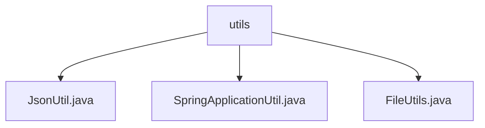

# 基础信息

|      |      |
|------|------|
| 名称 | utils |
| 编码语言 | .java |
| 代码路径 | spring-ai-alibaba/spring-ai-alibaba-studio/src/main/java/com/alibaba/cloud/ai/utils |
| 包名 | spring-ai-alibaba.spring-ai-alibaba-studio.src.main.java.com.alibaba.cloud.ai.utils |
| 概述说明 | JsonUtil类简化JSON生成，Spring工具类管理应用配置，FileUtils类处理文件操作。 |

# 说明

## 概述
该代码模块主要包含三个工具类：`JsonUtil`、`SpringApplicationUtil` 和 `FileUtils`。这些工具类分别用于处理JSON数据生成、Spring应用上下文管理以及文件操作。通过这些工具类，开发者可以简化常见开发任务，提高代码的可维护性和开发效率。

## 主要业务场景
1. **JSON数据处理**：`JsonUtil` 类提供了静态方法来创建 `JsonGenerator` 对象，简化了在内存中生成JSON数据的过程。适用于需要动态生成或操作JSON格式数据的场景，如API响应、数据序列化等。
2. **Spring应用管理**：`SpringApplicationUtil` 类用于管理Spring应用上下文和环境配置，提供获取Bean和配置项的功能。适用于需要从Spring容器中获取Bean实例或配置参数的场景，如依赖注入、配置管理等。
3. **文件操作**：`FileUtils` 类提供了创建文件和读取文件内容的功能，简化了文件管理任务。适用于需要生成新文件或读取已有文件数据的场景，如配置文件管理、日志处理等。

### 包内部结构视图

该流程图展示了`utils`文件夹下的三个Java文件：`JsonUtil.java`、`SpringApplicationUtil.java`和`FileUtils.java`。这些文件都位于`utils`目录中，且彼此之间没有进一步的层级关系。流程图清晰地反映了文件的组织结构，便于理解项目中的工具类文件分布。

# 文件列表 File List

| 名称   | 类型  | 说明 |
|-------|------|-------------|
| [FileUtils.java](FileUtils.md) | file | FileUtils类用于创建和读取文件。 |
| [JsonUtil.java](JsonUtil.md) | file | JsonUtil类提供静态方法生成内存中的JSON。 |
| [SpringApplicationUtil.java](SpringApplicationUtil.md) | file | Spring工具类管理应用上下文，支持获取Bean和配置项。 |

