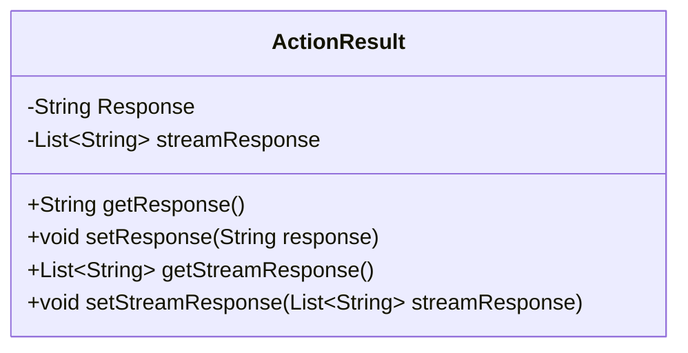
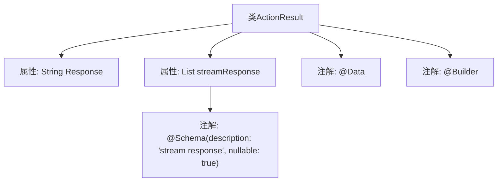

# 基础信息

|      |      |
|------|------|
| 名称 | ActionResult |
| 编码语言 | .java |
| 代码路径 | spring-ai-alibaba/spring-ai-alibaba-studio/src/main/java/com/alibaba/cloud/ai/vo/ActionResult.java |
| 包名 | com.alibaba.cloud.ai.vo |
| 依赖项 | ['io.swagger.v3.oas.annotations.media.Schema', 'java.util.List', 'lombok.Builder', 'lombok.Data'] |
| 概述说明 | ActionResult类包含Response字符串和streamResponse字符串列表。 |

# 说明

ActionResult类是一个包含两个主要属性的类。第一个属性是Response，它是一个字符串类型，用于存储操作的结果或响应信息。第二个属性是streamResponse，它是一个字符串列表，用于存储与操作相关的流式响应数据。这两个属性共同构成了ActionResult类的核心功能，使其能够有效地管理和返回操作的结果。

# 类列表 Class Summary

| 名称   | 类型  | 说明 |
|-------|------|-------------|
| ActionResult | class | ActionResult类包含Response字符串和streamResponse字符串列表。 |

## 类 ActionResult

|      |      |
|------|------|
| 访问范围 | @Data;@Builder;public |
| 类型 | class |
| 名称 | ActionResult |
| 说明 | ActionResult类包含Response字符串和streamResponse字符串列表。 |

### UML类图

这段代码定义了一个名为 `ActionResult` 的类，该类包含两个私有成员变量：`Response` 和 `streamResponse`。`Response` 是一个字符串类型的变量，而 `streamResponse` 是一个字符串列表类型的变量。类中还提供了这两个变量的 getter 和 setter 方法，用于访问和修改它们的值。`@Data` 和 `@Builder` 注解通常用于自动生成 getter、setter、toString、equals 和 hashCode 等方法，以及构建器模式的代码。`@Schema` 注解用于描述 `streamResponse` 字段的特性，如可空性等。

### 内部方法调用关系图

这段代码定义了一个名为 `ActionResult` 的类，该类包含两个属性：`Response` 和 `streamResponse`。`Response` 是一个字符串类型的属性，而 `streamResponse` 是一个字符串列表类型的属性，并且使用了 `@Schema` 注解来描述该属性的特性。类上还应用了 `@Data` 和 `@Builder` 注解，分别用于自动生成 getter、setter、toString 等方法以及构建器模式。

### 字段列表 Field List

| 名称  | 类型  | 说明 |
|-------|-------|------|
| Response | String | 定义了一个私有的字符串变量Response。 |
| streamResponse | List<String> | 流响应字段，可为空，类型为字符串列表。 |

### 方法列表 Method List

| 名称  | 类型  | 说明 |
|-------|-------|------|

