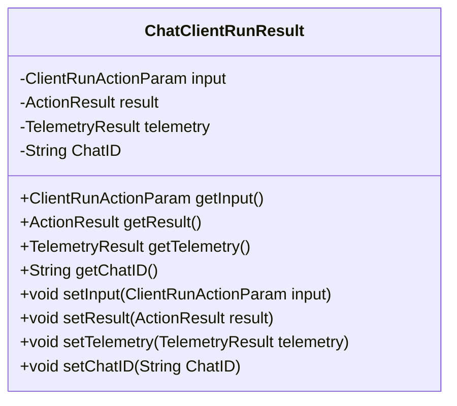
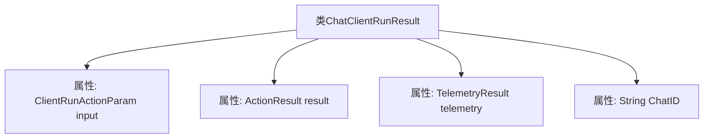

# 基础信息

|      |      |
|------|------|
| 名称 | ChatClientRunResult |
| 编码语言 | .java |
| 代码路径 | spring-ai-alibaba/spring-ai-alibaba-studio/src/main/java/com/alibaba/cloud/ai/vo/ChatClientRunResult.java |
| 包名 | com.alibaba.cloud.ai.vo |
| 依赖项 | ['com.alibaba.cloud.ai.param.ClientRunActionParam', 'lombok.Builder', 'lombok.Data'] |
| 概述说明 | ChatClientRunResult类包含输入、结果、遥测和聊天ID。 |

# 说明

ChatClientRunResult类是一个用于封装聊天客户端运行结果的数据结构，包含四个主要部分：输入参数、执行结果、遥测数据和聊天ID。输入参数记录了运行时的输入信息，执行结果存储了操作的实际输出，遥测数据用于监控和分析系统性能，聊天ID则用于唯一标识每次聊天会话。这个类为开发者提供了全面的运行信息，便于调试和优化聊天客户端。

# 类列表 Class Summary

| 名称   | 类型  | 说明 |
|-------|------|-------------|
| ChatClientRunResult | class | ChatClientRunResult类包含输入参数、执行结果、遥测数据和聊天ID。 |

## 类 ChatClientRunResult

|      |      |
|------|------|
| 访问范围 | @Data;@Builder;public |
| 类型 | class |
| 名称 | ChatClientRunResult |
| 说明 | ChatClientRunResult类包含输入参数、执行结果、遥测数据和聊天ID。 |

### UML类图

这段代码定义了一个名为 `ChatClientRunResult` 的类，它包含了四个私有成员变量：`input`、`result`、`telemetry` 和 `ChatID`。类中提供了这些成员变量的getter和setter方法，用于访问和修改这些属性。`ChatClientRunResult` 类通常用于封装聊天客户端运行时的结果数据，包括输入参数、操作结果、遥测数据和聊天ID。这个类的设计简洁明了，适合用于数据传输和存储。

### 内部方法调用关系图

这段代码定义了一个名为`ChatClientRunResult`的类，使用了`@Data`和`@Builder`注解。该类包含四个属性：`input`、`result`、`telemetry`和`ChatID`。`@Data`注解自动生成了getter、setter、toString、equals和hashCode方法，而`@Builder`注解则生成了一个构建器模式，用于方便地创建该类的实例。流程图展示了类与各个属性之间的关系，清晰地反映了类的结构。

### 字段列表 Field List

| 名称  | 类型  | 说明 |
|-------|-------|------|
| ChatID | String | 定义私有字符串变量ChatID。 |
| input | ClientRunActionParam | 私有ClientRunActionParam类型变量input。 |
| result | ActionResult | 私有ActionResult类型变量result声明。 |
| telemetry | TelemetryResult | 私有变量telemetry存储遥测结果。 |

### 方法列表 Method List

| 名称  | 类型  | 说明 |
|-------|-------|------|

