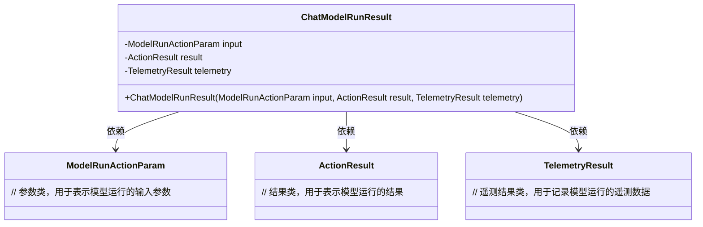
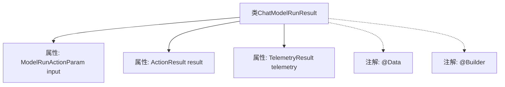

# 基础信息

|      |      |
|------|------|
| 名称 | ChatModelRunResult |
| 编码语言 | .java |
| 代码路径 | spring-ai-alibaba/spring-ai-alibaba-studio/src/main/java/com/alibaba/cloud/ai/vo/ChatModelRunResult.java |
| 包名 | com.alibaba.cloud.ai.vo |
| 依赖项 | ['com.alibaba.cloud.ai.param.ModelRunActionParam', 'lombok.Builder', 'lombok.Data'] |
| 概述说明 | ChatModelRunResult类包含输入、结果和遥测数据。 |

# 说明

ChatModelRunResult类是一个用于封装聊天模型运行结果的数据结构，包含三个主要部分：输入参数、操作结果和遥测数据。输入参数记录了模型运行时的初始配置和数据，操作结果保存了模型处理后的输出信息，遥测数据则用于记录模型运行过程中的性能指标和状态信息。

# 类列表 Class Summary

| 名称   | 类型  | 说明 |
|-------|------|-------------|
| ChatModelRunResult | class | ChatModelRunResult类包含输入参数、操作结果和遥测数据。 |

## 类 ChatModelRunResult

|      |      |
|------|------|
| 访问范围 | @Data;@Builder;public |
| 类型 | class |
| 名称 | ChatModelRunResult |
| 说明 | ChatModelRunResult类包含输入参数、操作结果和遥测数据。 |

### UML类图

这段代码定义了一个名为 `ChatModelRunResult` 的类，该类包含了三个私有成员变量：`input`、`result` 和 `telemetry`，分别表示模型运行的输入参数、运行结果和遥测数据。`ChatModelRunResult` 类依赖于 `ModelRunActionParam`、`ActionResult` 和 `TelemetryResult` 这三个类，分别用于存储不同类型的运行数据。通过这种结构，`ChatModelRunResult` 能够有效地封装和管理模型运行的完整信息。

### 内部方法调用关系图

这段代码定义了一个名为`ChatModelRunResult`的类，该类包含了三个属性：`input`、`result`和`telemetry`，分别对应`ModelRunActionParam`、`ActionResult`和`TelemetryResult`类型。类上使用了`@Data`和`@Builder`注解，`@Data`注解自动生成getter、setter、toString等方法，`@Builder`注解提供了构建者模式的实现。流程图展示了类与其属性和注解之间的关系，清晰地反映了类的结构。

### 字段列表 Field List

| 名称  | 类型  | 说明 |
|-------|-------|------|
| input | ModelRunActionParam | 私有变量input为ModelRunActionParam类型。 |
| result | ActionResult | 定义私有ActionResult类型变量result。 |
| telemetry | TelemetryResult | 私有变量telemetry存储遥测结果数据。 |

### 方法列表 Method List

| 名称  | 类型  | 说明 |
|-------|-------|------|

