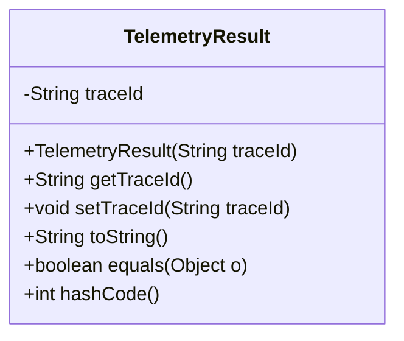
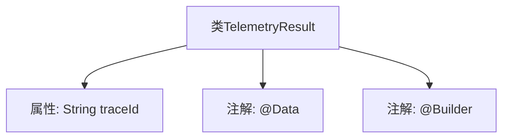

# 基础信息

|      |      |
|------|------|
| 名称 | TelemetryResult |
| 编码语言 | .java |
| 代码路径 | spring-ai-alibaba/spring-ai-alibaba-studio/src/main/java/com/alibaba/cloud/ai/vo/TelemetryResult.java |
| 包名 | com.alibaba.cloud.ai.vo |
| 依赖项 | ['lombok.Builder', 'lombok.Data'] |
| 概述说明 | TelemetryResult类采用@Data和@Builder注解，包含traceId字段。 |

# 说明

TelemetryResult类使用了@Data和@Builder注解，表明它是一个包含自动生成getter、setter、toString、equals和hashCode方法的数据类，并且支持通过构建器模式创建对象。该类包含一个名为traceId的字段，用于存储跟踪标识信息。

# 类列表 Class Summary

| 名称   | 类型  | 说明 |
|-------|------|-------------|
| TelemetryResult | class | TelemetryResult类使用@Data和@Builder注解，包含traceId字段。 |

## 类 TelemetryResult

|      |      |
|------|------|
| 访问范围 | @Data;@Builder;public |
| 类型 | class |
| 名称 | TelemetryResult |
| 说明 | TelemetryResult类使用@Data和@Builder注解，包含traceId字段。 |

### UML类图

这段代码定义了一个名为 `TelemetryResult` 的类，该类包含一个私有成员变量 `traceId`，并提供了构造函数、getter、setter、toString、equals 和 hashCode 方法。`@Data` 注解自动生成了这些方法，而 `@Builder` 注解则提供了一个构建器模式来创建该类的实例。这个类主要用于封装与遥测数据相关的信息，特别是 `traceId`，用于标识和追踪请求的路径。

### 内部方法调用关系图

这段代码定义了一个名为`TelemetryResult`的类，使用了`@Data`和`@Builder`注解。`@Data`注解通常用于自动生成`getter`、`setter`、`equals`、`hashCode`和`toString`方法，而`@Builder`注解用于生成一个构建器模式的类，方便链式调用。类中包含一个`String`类型的属性`traceId`，用于存储跟踪ID。通过注解，代码简洁且功能强大，减少了手动编写样板代码的工作量。

### 字段列表 Field List

| 名称  | 类型  | 说明 |
|-------|-------|------|
| traceId | String | 定义一个私有字符串变量traceId。 |

### 方法列表 Method List

| 名称  | 类型  | 说明 |
|-------|-------|------|

