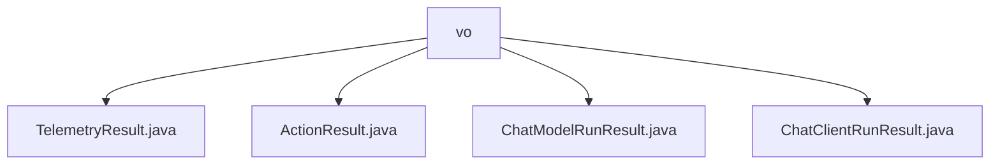

# 基础信息

|      |      |
|------|------|
| 名称 | vo |
| 编码语言 | .java |
| 代码路径 | spring-ai-alibaba/spring-ai-alibaba-studio/src/main/java/com/alibaba/cloud/ai/vo |
| 包名 | spring-ai-alibaba.spring-ai-alibaba-studio.src.main.java.com.alibaba.cloud.ai.vo |
| 概述说明 | TelemetryResult类为数据类，含traceId字段。ActionResult类含Response和streamResponse属性。ChatModelRunResult类封装输入、操作结果和遥测数据。ChatClientRunResult类封装输入、执行结果、遥测数据和聊天ID。 |

# 说明

## 概述

该代码模块主要围绕聊天模型和客户端的运行结果进行数据封装和管理。模块中包含多个数据类，分别用于存储不同类型的运行结果和相关信息。这些类通过使用注解（如 `@Data` 和 `@Builder`）自动生成常用方法，并支持构建器模式创建对象，提高了代码的可读性和可维护性。模块的核心功能包括记录输入参数、操作结果、遥测数据以及唯一标识信息，为开发者提供了全面的运行信息，便于调试和优化系统。

## 主要业务场景

1. **聊天模型运行结果管理**：`ChatModelRunResult` 类用于封装聊天模型的运行结果，包括输入参数、操作结果和遥测数据。适用于需要记录和分析模型运行状态的场景，如模型性能监控和调试。

2. **聊天客户端运行结果管理**：`ChatClientRunResult` 类扩展了聊天模型的结果管理，增加了聊天ID字段，用于唯一标识每次聊天会话。适用于需要跟踪和管理客户端运行结果的场景，如聊天会话分析和客户端性能优化。

3. **操作结果封装**：`ActionResult` 类用于存储操作的结果或响应信息，支持存储流式响应数据。适用于需要返回操作结果并处理流式数据的场景，如API响应处理和流式数据传输。

4. **遥测数据记录**：`TelemetryResult` 类用于存储跟踪标识信息，适用于需要记录和分析系统运行过程中产生的遥测数据的场景，如系统监控和性能分析。

这些业务场景共同构成了一个完整的聊天系统运行结果管理模块，帮助开发者更好地理解和优化系统行为。

### 包内部结构视图

该流程图展示了在`vo`目录下的四个Java文件之间的层级关系。`vo`作为根节点，包含了`TelemetryResult.java`、`ActionResult.java`、`ChatModelRunResult.java`和`ChatClientRunResult.java`四个子节点，清晰地反映了这些文件在项目中的组织结构。

# 文件列表 File List

| 名称   | 类型  | 说明 |
|-------|------|-------------|
| [ChatModelRunResult.java](ChatModelRunResult.md) | file | ChatModelRunResult类包含输入、结果和遥测数据。 |
| [TelemetryResult.java](TelemetryResult.md) | file | TelemetryResult类采用@Data和@Builder注解，包含traceId字段。 |
| [ChatClientRunResult.java](ChatClientRunResult.md) | file | ChatClientRunResult类包含输入、结果、遥测和聊天ID。 |
| [ActionResult.java](ActionResult.md) | file | ActionResult类包含Response字符串和streamResponse字符串列表。 |

